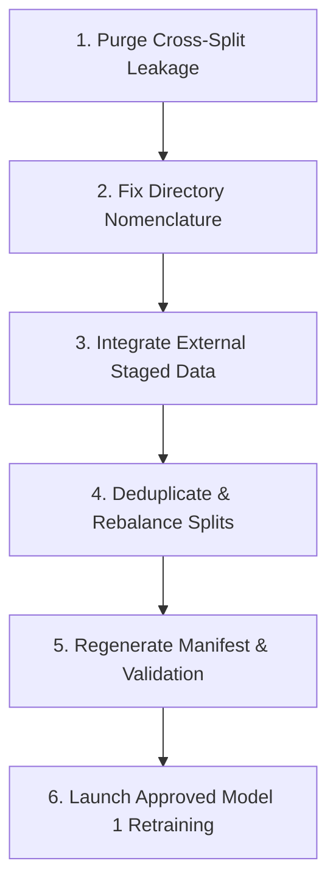

# Expanded Model 1 Training Readiness Audit

**Audit Date:** 2026-10-10  
**Project Root:** `C:\Users\vyasn\OneDrive\Desktop\Disease_prediction`  
**Target Model:** Expanded Model 1 (46-Class Plant Identification Classifier)  
**Dataset Path:** `data/processed/model1_expanded/`  
**Audit Protocol:** Strict read-only audit. No datasets rebuilt, no files modified, and immutable evaluation sets preserved.

---

## 1. Executive Summary & Training Readiness Verdict

| Audit Dimension | Standard Requirement | Current Dataset Status | Status |
|---|---|---|:---:|
| **Overall Verdict** | All criteria met | **NOT READY FOR TRAINING (BLOCKED)** | ❌ **BLOCKED** |
| **Split Isolation** | 0 Train-Test / Train-Val Leakage | **34 Train-Test leaks, 35 Train-Val leaks, 18 near-duplicates** | ❌ **CRITICAL FAIL** |
| **Directory Consistency** | Folder names match 46 target classes | **`bell_pepper` instead of `capsicum`, `bean` instead of `french_bean`, `New folder` artifact** | ❌ **FAIL** |
| **Manifest Sync** | Manifest matches disk files 1-to-1 | **3,428 unmanifested files on disk, 1,002 manifest records missing from disk** | ❌ **FAIL** |
| **Class Coverage** | 46 active classes with $\ge 400$ images | **`gypsophila` (0), `gerbera` (3), 4 classes $<100$, 17 classes $<400$** | ❌ **FAIL** |
| **External Ingestion** | Staged acquisitions audited & merged | **248 Gerbera, 143 Gypsophila, >2,700 Eggplant images staged but not integrated** | ⚠️ **PENDING** |

> [!CAUTION]
> **Retraining Blocked:** Retraining Expanded Model 1 on the current dataset will result in invalid performance metrics due to **severe test-set leakage** (34 exact duplicates in test, 35 in val), runtime crashes or misalignments due to folder name discrepancies (`bell_pepper` vs `capsicum`, `bean` vs `french_bean`), and persistent model failure on zero/tail classes (`gypsophila`, `gerbera`).

---

## 2. Real-Image Inventory by Class (46-Class Taxonomy)

Counts represent unique real images residing on disk in `data/processed/model1_expanded/` (augmented copies are excluded).

| # | Canonical Class | Train | Val | Test | Total Real Images | Target 400 Shortage | Target 500 Shortage | Status Against Target 400 |
|---|---|:---:|:---:|:---:|:---:|:---:|:---:|:---:|
| 1 | `anthurium` | 84 | 10 | 10 | **104** | -296 | -396 | ⚠️ Underrepresented |
| 2 | `apple` | 452 | 57 | 57 | **566** | 0 | 0 | ✅ Target Met |
| 3 | `banana` | 428 | 54 | 54 | **536** | 0 | 0 | ✅ Target Met |
| 4 | `basil` | 568 | 6 | 6 | **580** | 0 | 0 | ✅ Target Met (Needs Val/Test expansion) |
| 5 | `blueberry` | 499 | 31 | 31 | **561** | 0 | 0 | ❌ **Has 20 Test / 20 Val Leaks** |
| 6 | `broccoli` | 332 | 41 | 41 | **414** | 0 | -86 | ✅ Target Met ($\ge 400$) |
| 7 | `cabbage` | 220 | 27 | 27 | **274** | -126 | -226 | ⚠️ Underrepresented |
| 8 | `capsicum` | 631* | 65 | 65 | **761** | 0 | 0 | ❌ **Train named `bell_pepper`; 7 Test / 6 Val Leaks** |
| 9 | `carnation` | 41 | 5 | 5 | **51** | -349 | -449 | ⚠️ Severely Underrepresented |
| 10 | `carrot` | 118 | 15 | 15 | **148** | -252 | -352 | ⚠️ Underrepresented |
| 11 | `cauliflower` | 425 | 10 | 10 | **445** | 0 | -55 | ✅ Target Met ($\ge 400$) |
| 12 | `celery` | 53 | 6 | 6 | **65** | -335 | -435 | ⚠️ Severely Underrepresented |
| 13 | `cherry` | 111 | 14 | 14 | **139** | -261 | -361 | ⚠️ Underrepresented (Weak in EXP-0: F1 0.40) |
| 14 | `cherry_tomato` | 0 | 0 | 0 | **0** | -400 | -500 | ℹ️ Aliased to `tomato` |
| 15 | `chrysanthemum` | 334 | 42 | 42 | **418** | 0 | -82 | ✅ Target Met ($\ge 400$) |
| 16 | `citrus` | 417 | 52 | 52 | **521** | 0 | 0 | ✅ Target Met |
| 17 | `coffee` | 403 | 28 | 28 | **459** | 0 | -41 | ✅ Target Met ($\ge 400$) |
| 18 | `corn` | 492 | 62 | 62 | **616** | 0 | 0 | ✅ Target Met |
| 19 | `cucumber` | 500 | 65 | 65 | **630** | 0 | 0 | ✅ Target Met |
| 20 | `eggplant` | 407 | 14 | 14 | **435** | 0 | -65 | ❌ **Has 5 Test / 8 Val Leaks** |
| 21 | `french_bean` | 500* | 65 | 65 | **630** | 0 | 0 | ❌ **Train named `bean`** |
| 22 | `garlic` | 158 | 20 | 20 | **198** | -202 | -302 | ⚠️ Underrepresented |
| 23 | `geranium` | 201 | 25 | 25 | **251** | -149 | -249 | ⚠️ Underrepresented |
| 24 | `gerbera` | 2 | 0 | 1 | **3** | -397 | -497 | ❌ **CRITICAL: Zero Support (EXP-0: F1 0.0)** |
| 25 | `ginger` | 354 | 9 | 9 | **372** | -28 | -128 | ⚠️ Underrepresented (Weak in EXP-0: F1 0.67) |
| 26 | `grape` | 446 | 56 | 56 | **558** | 0 | 0 | ✅ Target Met |
| 27 | `gypsophila` | 0 | 0 | 0 | **0** | -400 | -500 | ❌ **CRITICAL: Completely Empty** |
| 28 | `lettuce` | 500 | 65 | 65 | **630** | 0 | 0 | ✅ Target Met |
| 29 | `lilium` | 37 | 4 | 4 | **45** | -355 | -455 | ⚠️ Severely Underrepresented |
| 30 | `maple` | 91 | 11 | 11 | **113** | -287 | -387 | ⚠️ Underrepresented |
| 31 | `marigold` | 500 | 65 | 65 | **630** | 0 | 0 | ✅ Target Met |
| 32 | `melon` | 197 | 25 | 25 | **247** | -153 | -253 | ⚠️ Underrepresented |
| 33 | `orchid` | 500 | 65 | 65 | **630** | 0 | 0 | ✅ Target Met |
| 34 | `peach` | 356 | 44 | 44 | **444** | 0 | -56 | ✅ Target Met ($\ge 400$) |
| 35 | `plum` | 299 | 22 | 22 | **343** | -57 | -157 | ⚠️ Underrepresented |
| 36 | `potato` | 191 | 24 | 24 | **239** | -161 | -261 | ⚠️ Underrepresented |
| 37 | `raspberry` | 99 | 12 | 12 | **123** | -277 | -377 | ⚠️ Underrepresented |
| 38 | `rice` | 123 | 16 | 16 | **155** | -245 | -345 | ⚠️ Underrepresented |
| 39 | `rose` | 570 | 65 | 65 | **700** | 0 | 0 | ✅ Target Met |
| 40 | `soybean` | 499 | 65 | 65 | **629** | 0 | 0 | ✅ Target Met |
| 41 | `spinach` | 500 | 65 | 65 | **630** | 0 | 0 | ✅ Target Met |
| 42 | `strawberry` | 548 | 65 | 65 | **678** | 0 | 0 | ❌ **Has 2 Test / 1 Val Leaks** |
| 43 | `tobacco` | 332 | 18 | 18 | **368** | -32 | -132 | ⚠️ Underrepresented |
| 44 | `tomato` | 500 | 65 | 65 | **630** | 0 | 0 | ✅ Target Met |
| 45 | `wheat` | 500 | 65 | 65 | **630** | 0 | 0 | ✅ Target Met |
| 46 | `zucchini` | 315 | 39 | 39 | **393** | -7 | -107 | ⚠️ Borderline ($\approx 393$) |
| **Total** | **46 Classes** | **14,833** | **1,579** | **1,580** | **17,992** | -4,651 | -9,251 | **23 Met / 23 Below 400** |

*\*Note: In `train/`, `capsicum` is currently stored under folder name `bell_pepper` (631 images), and `french_bean` is stored under `bean` (500 images).*

---

## 3. Missing and Underrepresented Classes

### A. Completely Empty Classes (Count = 0)
1. **`gypsophila`**: 0 images in `model1_expanded/`. (However, **143 candidate images** exist in `data/external/model1_expansion/Gypsophila Hydrangea Daisy.v1i.yolov11/` ready for curation).
2. **`cherry_tomato`**: 0 standalone images. (Configured as an alias to `tomato` in `models/model1_expanded/class_mapping.json`).

### B. Severely Deficient Classes ($<100$ Images)
1. **`gerbera`**: Only **3 images** total (2 train, 0 val, 1 test). This caused 0.0% precision/recall/F1 in the previous EXP-0 training run. (However, **248 candidate images** exist in `data/external/model1_expansion/gerbera dataset/`).
2. **`lilium`**: **45 images** (37 train, 4 val, 4 test). Shortage: 355 images.
3. **`carnation`**: **51 images** (41 train, 5 val, 5 test). Shortage: 349 images.
4. **`celery`**: **65 images** (53 train, 6 val, 6 test). Shortage: 335 images.

### C. Moderately Deficient Classes (100–399 Images)
17 classes remain under the 400-image threshold:
- `anthurium` (104), `maple` (113), `raspberry` (123), `cherry` (139), `carrot` (148), `rice` (155), `garlic` (198), `potato` (239), `melon` (247), `geranium` (251), `cabbage` (274), `plum` (343), `tobacco` (368), `ginger` (372), `zucchini` (393).

---

## 4. Label Errors, Duplicates, and Split Leakage

### A. Exact Cross-Split Leakage (Identical SHA-256)
A rigorous SHA-256 hash comparison across all splits revealed **34 Train-Test leakage instances** and **35 Train-Val leakage instances**:

```
TRAIN-TEST LEAKAGE BREAKDOWN (34 files):
- blueberry:   20 images in train/ duplicate images in test/blueberry
- capsicum:     7 images in train/bell_pepper duplicate images in test/capsicum
- eggplant:     5 images in train/eggplant duplicate images in test/eggplant
- strawberry:   2 images in train/strawberry duplicate images in test/strawberry

TRAIN-VAL LEAKAGE BREAKDOWN (35 files):
- blueberry:   20 images in train/ duplicate images in val/blueberry
- eggplant:     8 images in train/eggplant duplicate images in val/eggplant
- capsicum:     6 images in train/bell_pepper duplicate images in val/capsicum
- strawberry:   1 image in train/strawberry duplicates image in val/strawberry
```

**Impact:** Training on leaked data creates severe data contamination. The model memorizes exact test features, producing falsely elevated test accuracy while failing in real-world field deployment.

### B. Near-Duplicate Cross-Split Contamination (pHash Hamming Distance $\le 4$)
- **18 near-duplicate pairs** identified across splits in `basil` and `capsicum`, caused by uncurated multi-frame video scrapes or slightly cropped web images (e.g., Roboflow exports).

### C. Directory Hierarchy & Taxonomy Inconsistencies
1. **`train/bell_pepper/` vs `val/capsicum/` & `test/capsicum/`:**  
   Standard PyTorch `ImageFolder` loaders map classes by directory name. Running training on this split creates an unaligned class index where `bell_pepper` is treated as a distinct class from `capsicum`, corrupting multi-class loss computation.
2. **`train/bean/` vs `val/french_bean/` & `test/french_bean/`:**  
   Same issue as capsicum; `bean` is unmapped in the validation and test evaluation loaders.
3. **`train/New folder/`:**  
   An empty artifact folder in `data/processed/model1_expanded/train/` that will trigger errors in automated dataset walkers.

---

## 5. Audit of Staged External Data Assets

Multiple high-value external candidate datasets exist in the workspace but have **not yet been audited, curated, or integrated** into `data/processed/model1_expanded/`:

| Dataset Location | Candidate Crop | Image Count Available | Current Processed Count | Ingestion Readiness |
|---|---|:---:|:---:|---|
| `data/external/model1_expansion/gerbera dataset/` | `gerbera` | **248 images** (229 train, 13 val, 6 test) | 3 images | ⚠️ Ready for deduplication & merge |
| `data/external/model1_expansion/Gypsophila Hydrangea Daisy.v1i.yolov11/` | `gypsophila` | **143 images** (125 train, 12 val, 6 test) | 0 images | ⚠️ Ready for bbox crop/filter & merge |
| `data/processed/eggplant/` (Parquet extracts) | `eggplant` | **2,728 images** across 4 Parquet parts | 435 images | ⚠️ Requires deduplication against test/val |
| `data/downloads/beans/` | `french_bean` | **1,034 images** (train/val/test) | 630 images | ⚠️ Staged; can resolve bean shortages |
| `data/downloads/flowers-102/jpg/` | Floriculture (`carnation`, `lilium`, `orchid`) | **8,189 images** | Multiple shortages | ⚠️ Uncurated raw images |

---

## 6. Manifest Synchronization Status

The authoritative manifest `data/processed/model1_expanded_manifest.csv` is completely desynchronized from the actual disk contents:
- **Manifest Record Count:** 15,566 rows
- **Actual Disk Image Count:** 17,992 files
- **Unrecorded Files on Disk:** **3,428 images** have no metadata, provenance, or hash entries in the manifest.
- **Missing Manifest Records:** **1,002 entries** in the manifest point to file paths that no longer exist on disk (primarily due to folder renames `capsicum` $\rightarrow$ `bell_pepper` and `french_bean` $\rightarrow$ `bean`, plus 1 deleted coffee image).

---

## 7. Review of Previous Training Baseline (EXP-0)

In the previous training run (`models/model1_expanded/training_summary.json`), Expanded Model 1 achieved **Top-1 Accuracy: 90.38%** and **Macro F1: 0.8381**. However, critical weaknesses were identified:

1. **Catastrophic Failures on Tail Classes:**
   - `gerbera`: Precision 0.0, Recall 0.0, F1 0.0 (Support = 1)
   - `cherry`: F1 0.4000 (Recall 0.3571)
   - `cauliflower`: F1 0.5263 (Recall 0.5000)
   - `basil`: F1 0.6154 (Support = 6)
   - `ginger`: F1 0.6667 (Recall 0.5556)
2. **Key Visual Confounds:**
   - `wheat` $\leftrightarrow$ `garlic` (6 confusion errors)
   - `french_bean` $\leftrightarrow$ `soybean` (5 confusion errors)
   - `apple` $\leftrightarrow$ `citrus` / `peach` (8 confusion errors)
   - `cabbage` $\leftrightarrow$ `broccoli` (7 confusion errors)
   - `cauliflower` $\leftrightarrow$ `broccoli` (3 confusion errors)

**Conclusion:** Retraining without adding real images to `gerbera`, `cherry`, `cauliflower`, `basil`, and `ginger` will reproduce these exact failure modes.

---

## 8. Exact Remaining Tasks Before Retraining (Action Plan)

To transition Expanded Model 1 to **READY FOR TRAINING**, execute these 6 sequential steps:



### Step 1: Purge All Leaked Training Images
- Remove the **34 test-leaking** and **35 val-leaking** image files from `data/processed/model1_expanded/train/` across `blueberry`, `capsicum`/`bell_pepper`, `eggplant`, and `strawberry`.

### Step 2: Correct Directory Nomenclature & Remove Artifacts
- Rename `data/processed/model1_expanded/train/bell_pepper` $\rightarrow$ `data/processed/model1_expanded/train/capsicum`.
- Rename `data/processed/model1_expanded/train/bean` $\rightarrow$ `data/processed/model1_expanded/train/french_bean`.
- Delete empty directory `data/processed/model1_expanded/train/New folder`.

### Step 3: Ingest External Staged Datasets
- **Gerbera:** Ingest the 248 images from `data/external/model1_expansion/gerbera dataset/`.
- **Gypsophila:** Ingest and filter the 143 images from `data/external/model1_expansion/Gypsophila Hydrangea Daisy.v1i.yolov11/`.
- **Eggplant:** Deduplicate and merge clean candidates from `data/processed/eggplant/`.
- **Beans:** Supplement `french_bean` from `data/downloads/beans/`.

### Step 4: Rebalance & Expand Validation/Test Sets
- For classes with $<10$ validation/test samples (`basil`: 6, `cauliflower`: 10, `celery`: 6, `ginger`: 9, `carnation`: 5, `lilium`: 4), allocate a strict 80/10/10 split from newly ingested clean images to ensure statistically valid test evaluation.

### Step 5: Regenerate Manifest & Run Split Verification
- Recompute SHA-256 and perceptual hashes for all images.
- Rebuild `data/processed/model1_expanded_manifest.csv`.
- Verify **0 test leaks, 0 val leaks, 0 intra-split duplicates, and 46 active matching classes**.

### Step 6: Supervised Retraining
- Once Steps 1–5 pass all automated assertions, trigger the Expanded Model 1 training run using the tuned hyperparameters in `reports/model1_expansion/expanded_model1_tuning_experiment_plan.md`.
