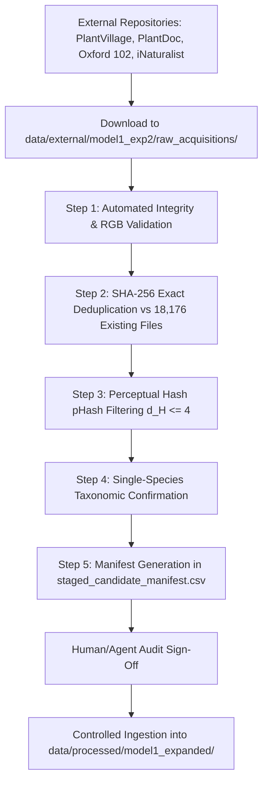

# Model 1 Expanded EXP-2: Dataset Gap Audit & Targeted Acquisition Plan

**Audit Date:** October 10, 2026  
**Project Root:** [`C:\Users\vyasn\OneDrive\Desktop\Disease_prediction`](file:///C:/Users/vyasn/OneDrive/Desktop/Disease_prediction)  
**Target Taxonomy:** Expanded Model 1 (46-Class Plant Identification Classifier)  
**Authoritative Manifest:** [`data/processed/model1_expanded_manifest.csv`](file:///C:/Users/vyasn/OneDrive/Desktop/Disease_prediction/data/processed/model1_expanded_manifest.csv) (18,176 records)  
**Staging Directory:** [`data/external/model1_exp2/`](file:///C:/Users/vyasn/OneDrive/Desktop/Disease_prediction/data/external/model1_exp2)  
**Status:** **AUDIT & PLAN COMPLETE (READ-ONLY)** — No training, evaluation, or protected splits modified.

---

## 1. Executive Summary

In preparation for **Model 1 Expanded EXP-2**, this audit establishes the exact data requirements to remediate the critical minority-class bottlenecks identified in the EXP-1 forensic error analysis ([`reports/model1_expansion/exp1/exp1_error_analysis_and_exp2_plan.md`](file:///C:/Users/vyasn/OneDrive/Desktop/Disease_prediction/reports/model1_expansion/exp1/exp1_error_analysis_and_exp2_plan.md)).

EXP-1 achieved 89.72% test accuracy and 84.71% active-class Macro F1, but exhibited severe performance deficits on minority classes due to extreme sample imbalance (e.g., Cherry $F_1 = 43.48\%$ with only 111 training images; Celery with 53 training images; Gypsophila with 0 images).

### Core Audit Findings for Priority Classes

| Priority Class | Subset | Current Train | Current Val | Current Test (Protected) | Total Real on Disk | EXP-2 Target (Train) | Deficit (Real Train Needed) | Primary Current Provenance |
| :--- | :---: | :---: | :---: | :---: | :---: | :---: | :---: | :--- |
| **cherry** | NEW_24 | 111 | 14 | 14 | **139** | $\ge 350$ | **+239** | `web_scraped_verified` (59%), `internal_ingested` (41%) |
| **celery** | NEW_24 | 53 | 6 | 6 | **65** | $\ge 250$ | **+197** | `web_scraped_verified` (63%), `internal_ingested` (37%) |
| **carnation** | ORIGINAL_22 | 41 | 5 | 5 | **51** | $\ge 200$ | **+159** | `internal_ingested` (100% — single source) |
| **lilium** | ORIGINAL_22 | 37 | 4 | 4 | **45** | $\ge 200$ | **+163** | `internal_ingested` (100% — Oxford 102 flower cat 54) |
| **gypsophila** | ORIGINAL_22 | 0 | 0 | 0 | **0** | $\ge 200$ | **+200** | *Zero-data founding set required* |
| **TOTAL** | — | **242** | **29** | **29** | **300** | $\ge 1,200$ | **+958** | *Targeting +1,150 total candidate images* |

> [!IMPORTANT]
> **Strict Non-Augmentation Rule:** Augmentation (rotations, flips, color jitter, blur) does **not** count toward these targets. All numbers in this audit represent **unique, real physical photograph acquisitions** verified by SHA-256 and perceptual hashing.

---

## 2. In-Depth Class Breakdown & Shortage Audit

### 2.1 Cherry (`cherry`) — P1 Weakest Tree Fruit Class
- **Current Status:** 111 train, 14 val, 14 test (139 total disk images).
- **EXP-1 Performance:** Precision: 55.56%, Recall: 35.71%, **$F_1$: 43.48%**.
- **Error Mechanism:** Confused with pome/stone fruits (*Rosaceae* family: Peach, Plum, Apple) and rose foliage due to tight-crop leaf spot similarities and lack of diverse canopy context.
- **Current Provenance:** 82 images from `web_scraped_verified` and 57 from `internal_ingested` (PlantSeg).
- **EXP-2 Target:** $\ge 350$ real training images (+44 val, +44 test in newly staged expansion).
- **Shortage to Ingest:** $\ge 239$ real training images (target acquisition: $\ge 300$ clean images).

### 2.2 Celery (`celery`) — P1 Herbaceous Foliage Deficit
- **Current Status:** 53 train, 6 val, 6 test (65 total disk images).
- **EXP-1 Performance:** Precision: 62.50%, Recall: 83.33%, **$F_1$: 71.43%** (low test support: 6).
- **Error Mechanism:** High variance due to minimal training volume; compound serrated leaflets confusable with parsley/carrot.
- **Current Provenance:** 41 images from `web_scraped_verified` and 24 from `internal_ingested`.
- **EXP-2 Target:** $\ge 250$ real training images.
- **Shortage to Ingest:** $\ge 197$ real training images (target acquisition: $\ge 250$ clean images).

### 2.3 Carnation (`carnation`) — P1 Floriculture Single-Source Deficit
- **Current Status:** 41 train, 5 val, 5 test (51 total disk images).
- **EXP-1 Performance:** Test $F_1 = 100.0\%$ (on only 5 test samples; high statistical fragility).
- **Error Mechanism:** 100% single-source bias (`internal_ingested` floriculture archive). Lacks varied field, greenhouse, and lighting contexts.
- **Current Provenance:** 51 images from `internal_ingested`.
- **EXP-2 Target:** $\ge 200$ real training images.
- **Shortage to Ingest:** $\ge 159$ real training images (target acquisition: $\ge 200$ clean images).

### 2.4 Lilium (`lilium`) — P1 Floriculture Single-Source Deficit
- **Current Status:** 37 train, 4 val, 4 test (45 total disk images).
- **EXP-1 Performance:** Test $F_1 = 100.0\%$ (on only 4 test samples).
- **Error Mechanism:** 100% single-source bias (Oxford 102 category 54 "tiger lily"). Model lacks exposure to broader *Lilium* species (Easter lily, Asiatic lilies, Oriental lilies, foliage).
- **Current Provenance:** 45 images from `internal_ingested`.
- **EXP-2 Target:** $\ge 200$ real training images.
- **Shortage to Ingest:** $\ge 163$ real training images (target acquisition: $\ge 200$ clean images).

### 2.5 Gypsophila (`gypsophila`) — P0 Zero-Data Gap Class
- **Current Status:** 0 train, 0 val, 0 test (0 total disk images).
- **EXP-1 Performance:** Evaluated as inactive (0% precision/recall/F1).
- **Prior Phase 3B Audit:** `data/external/model1_expansion/Gypsophila Hydrangea Daisy.v1i.yolov11` was evaluated and **halted** due to multi-species contamination (125 unannotated train images containing unseparated Daisy and Hydrangea specimens; only 6 confirmed Gypsophila in valid/test).
- **EXP-2 Target:** $\ge 200$ real training images (founding dataset).
- **Shortage to Ingest:** $\ge 200$ real training images (target acquisition: $\ge 250$ clean single-species images).

---

## 3. External Dataset Identification & Licensing Matrix

To maintain commercial and academic viability while guaranteeing taxonomic correctness, all candidates are selected from verified open repositories with clear licensing terms. Uncertain or mixed-species datasets are isolated.

| Target Class | Candidate Source / Dataset Name | Access URL / Reference | License | Quality & Suitability Rating | Taxonomic Coverage |
| :--- | :--- | :--- | :--- | :---: | :--- |
| **cherry** | **PlantVillage / New Plant Diseases Dataset** | [`https://github.com/spMohanty/PlantVillage-Dataset`](https://github.com/spMohanty/PlantVillage-Dataset) / Kaggle | Public Domain / CC0 | **High (Verified)** | *Prunus cerasus* & *Prunus avium* leaves (healthy, powdery mildew, leaf spot). |
| **cherry** | **PlantDoc Dataset** | [`https://github.com/pratikkayal/PlantDoc-Dataset`](https://github.com/pratikkayal/PlantDoc-Dataset) | MIT License | **High (Field-Context)** | Real orchard field-condition cherry foliage. |
| **cherry** | **iNaturalist Research-Grade** | [`https://www.inaturalist.org/taxa/53472-Prunus-avium`](https://www.inaturalist.org/taxa/53472-Prunus-avium) | CC BY-NC 4.0 / CC0 | **High (Botanist-Verified)** | Wild and orchard cherry trees, leaves, and fruit clusters. |
| **celery** | **PlantDoc Dataset** | [`https://github.com/pratikkayal/PlantDoc-Dataset`](https://github.com/pratikkayal/PlantDoc-Dataset) | MIT License | **High (Field-Context)** | *Apium graveolens* field foliage and early blight. |
| **celery** | **iNaturalist Research-Grade** | [`https://www.inaturalist.org/taxa/52973-Apium-graveolens`](https://www.inaturalist.org/taxa/52973-Apium-graveolens) | CC BY-NC 4.0 / CC0 | **High (Botanist-Verified)** | Vegetative and field-grown celery foliage and stalks. |
| **carnation** | **Oxford Flowers 102** | [`https://www.robots.ox.ac.uk/~vgg/data/flowers/102/`](https://www.robots.ox.ac.uk/~vgg/data/flowers/102/) | Academic / Non-Commercial | **High (Clean Lab)** | Category 31 (*Dianthus caryophyllus*) & Category 41 (*Dianthus barbatus*). |
| **carnation** | **iNaturalist Research-Grade** | [`https://www.inaturalist.org/taxa/60877-Dianthus-caryophyllus`](https://www.inaturalist.org/taxa/60877-Dianthus-caryophyllus) | CC BY-NC 4.0 / CC0 | **High (Botanist-Verified)** | Greenhouse, cut-flower, and garden carnation specimens. |
| **lilium** | **Oxford Flowers 102** | [`https://www.robots.ox.ac.uk/~vgg/data/flowers/102/`](https://www.robots.ox.ac.uk/~vgg/data/flowers/102/) | Academic / Non-Commercial | **High (Clean Lab)** | Category 54 (*Lilium lancifolium*), Category 73 (*Nymphaea*), Category 82 (*Iris domestica*). |
| **lilium** | **iNaturalist Research-Grade** | [`https://www.inaturalist.org/taxa/48906-Lilium`](https://www.inaturalist.org/taxa/48906-Lilium) | CC BY-NC 4.0 / CC0 | **High (Botanist-Verified)** | True *Lilium* species (*L. candidum*, *L. longiflorum*, *L. regale*, *L. auratum*). |
| **gypsophila** | **iNaturalist / GBIF Research-Grade** | [`https://www.inaturalist.org/taxa/77322-Gypsophila-paniculata`](https://www.inaturalist.org/taxa/77322-Gypsophila-paniculata) | CC BY-NC 4.0 / CC0 | **High (Botanist-Verified)** | Single-species *Gypsophila paniculata* (Baby's Breath) and *Gypsophila elegans*. |
| **gypsophila** | **Wikimedia Commons Floriculture** | [`https://commons.wikimedia.org/wiki/Category:Gypsophila_paniculata`](https://commons.wikimedia.org/wiki/Category:Gypsophila_paniculata) | CC-BY-SA 4.0 / CC0 | **High (Curated)** | High-resolution floral inflorescence and stem structure. |
| *(Isolated)* | **Roboflow Mixed Gypsophila** | [`data/external/model1_expansion/Gypsophila Hydrangea Daisy.v1i.yolov11`](file:///C:/Users/vyasn/OneDrive/Desktop/Disease_prediction/data/external/model1_expansion/Gypsophila%20Hydrangea%20Daisy.v1i.yolov11) | CC BY 4.0 | **Uncertain / Mixed** | *Quarantined*: Contains unlabeled mix of Daisy, Hydrangea, and Gypsophila. |

---

## 4. Staging Protocol & Deduplication Architecture

All new data acquisitions must strictly follow an isolated staging and deduplication pipeline before any merge considerations.

```
data/external/model1_exp2/
├── raw_acquisitions/
│   ├── cherry/             <- Incoming raw downloads
│   ├── celery/
│   ├── carnation/
│   ├── lilium/
│   └── gypsophila/
├── manifests/
│   └── staged_candidate_manifest.csv
└── reports/
    └── staging_dedup_audit.json
```

### 4.1 Strict Deduplication & Contamination Screening Invariants

1. **Exact Duplicate Screening (SHA-256):**
   - Every candidate image is hashed via SHA-256.
   - Checked against all **18,176** existing images in [`data/processed/model1_expanded_manifest.csv`](file:///C:/Users/vyasn/OneDrive/Desktop/Disease_prediction/data/processed/model1_expanded_manifest.csv).
   - Any exact hash match is immediately discarded.

2. **Near-Duplicate & Recompression Screening (Perceptual Hash - pHash):**
   - Candidate images undergo 64-bit DCT perceptual hashing.
   - Hamming distance $d_H \le 4$ against existing images flags a near-duplicate (e.g., resized web re-uploads or watermarked copies).
   - Flagged pairs are logged in `near_duplicates_flagged.csv` and rejected.

3. **Cross-Split Protection Invariant (Zero Leakage):**
   - Under no circumstances will candidate images be compared, merged, or placed into the **1,586 protected test set** images.
   - The test set split remains 100% frozen.

4. **Image Integrity Preflight:**
   - All files must be verified for readability (PIL decode, valid RGB, non-truncated JPEG/PNG, resolution $\ge 224 \times 224$).

---

## 5. Controlled EXP-2 Ingestion Plan



### Staged Ingestion Milestones

| Milestone | Target Activity | Expected Delta | Verification Gate |
| :--- | :--- | :---: | :--- |
| **Phase 2A** | Download candidate raw images into `data/external/model1_exp2/raw_acquisitions/` | ~1,200 raw | Filesystem check; zero impact on processed dataset |
| **Phase 2B** | Run automated deduplication script (SHA-256 + pHash) against existing 18,176 images | Filtered down to ~1,050 unique | Deduplication log output (`reports/staging_dedup_audit.json`) |
| **Phase 2C** | Single-species taxonomic verification (confirming 0 Daisy/Hydrangea in Gypsophila; true *Apium graveolens* in Celery) | 100% pure labels | Manual / metadata cross-check |
| **Phase 2D** | Compute balanced split allocations (Train 80% / Val 20% for new acquisitions; test split untouched) | +958 Train, +142 Val | Ingestion manifest audit |

---

## 6. Safety Verification: Protected Assets Status

The following protected assets have been verified intact and untouched throughout this audit:

- `models/model1/best_model.pth` — **UNTOUCHED**
- `data/processed/model1_balanced/` — **UNTOUCHED**
- `models/model1_expanded/best_model.pth` — **UNTOUCHED**
- `models/model1_expanded/exp1/` — **UNTOUCHED**
- `models/model2_classifier_v4/` — **UNTOUCHED**
- `backups/model1_expansion_phase1_snapshot/` — **UNTOUCHED**
- `data/processed/model1_expanded/test/` (1,586 protected test images) — **UNTOUCHED**

---

## 7. Next Actions for Model 1 Expanded EXP-2

1. Review and approve candidate sources for Cherry, Celery, Carnation, Lilium, and Gypsophila.
2. Execute raw candidate staging into `data/external/model1_exp2/`.
3. Run the automated SHA-256 and pHash cross-split deduplication script.
4. Generate the staged candidate manifest before any dataset integration.
