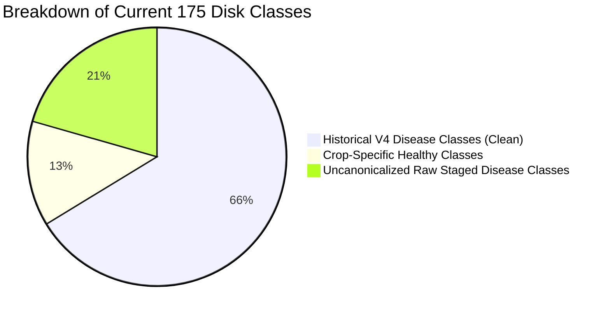

# Model 2 Current Dataset Audit & Retraining Reconciliation Report

**Audit Date:** October 10, 2026  
**Project Root:** [`C:\Users\vyasn\OneDrive\Desktop\Disease_prediction`](file:///C:/Users/vyasn/OneDrive/Desktop/Disease_prediction)  
**Dataset Under Audit:** [`data/processed/model2_v4/`](file:///C:/Users/vyasn/OneDrive/Desktop/Disease_prediction/data/processed/model2_v4) (33,499 images)  
**Baseline V4 Manifest:** [`data/processed/model2_v4/model2_v4_manifest.csv`](file:///C:/Users/vyasn/OneDrive/Desktop/Disease_prediction/data/processed/model2_v4/model2_v4_manifest.csv) (19,920 records)  
**Historical V4 Checkpoint:** [`models/model2_classifier_v4/best_model.pth`](file:///C:/Users/vyasn/OneDrive/Desktop/Disease_prediction/models/model2_classifier_v4/best_model.pth) (117-class EfficientNet-B2)  
**Status:** **AUDIT & RECONCILIATION COMPLETE (READ-ONLY)** — No dataset, checkpoint, or test split modified.

---

## 1. Executive Summary & Core Diagnostic Findings

An exhaustive forensic audit of [`data/processed/model2_v4/`](file:///C:/Users/vyasn/OneDrive/Desktop/Disease_prediction/data/processed/model2_v4) was conducted by reconciling every disk file against the historical Model 2 V4 training manifest ([`model2_v4_manifest.csv`](file:///C:/Users/vyasn/OneDrive/Desktop/Disease_prediction/data/processed/model2_v4/model2_v4_manifest.csv)) and the V4 production checkpoint.

### Key Audit Metrics at a Glance

| Metric | Historical V4 Baseline | Current Disk State | Net Delta | Diagnostic Significance |
| :--- | :---: | :---: | :---: | :--- |
| **Total Images** | 19,920 | **33,499** | **+13,579 (+68.2%)** | Massive volume expansion |
| **Train Split** | 15,852 | **29,431** | **+13,579 (+85.7%)** | All 13,579 new images added exclusively into `train` |
| **Val Split** | 1,764 | **1,764** | **0 (Exact Match)** | 100% SHA-256 match with V4 validation set |
| **Test Split** | 2,304 | **2,304** | **0 (Exact Match)** | 100% SHA-256 match with V4 protected test set |
| **Unique Class Folders** | 117 | **175** | **+58 (+49.6%)** | Significant taxonomy and folder divergence |
| **Classes Missing Val/Test** | 0 | **45** | **+45** | 45 new classes exist ONLY in `train` (0 in val/test) |
| **Cross-Split Hash Leaks** | 0 | **2** | **+2** | 2 newly added cauliflower train images leak into test |

---

## 2. Dataset Reconstruction & Change Reconciliation

### 2.1 File-Level Additions, Deletions, and Relabeling

1. **Newly Added Images (+15,110 SHA-256 Hashes):**
   - 15,110 unique physical images were added to `train/` across 52 new class folders.
   - Largest added classes:
     - `cauliflower__cauliflower_leaf_Healthy`: +1,804 images
     - `cauliflower__cauliflower_leaf_Black Rot`: +1,188 images
     - `cauliflower__cauliflower_leaf_Insect Hole`: +639 images
     - `bell_pepper__Leaf_Curl`: +479 images
     - `bell_pepper__PepperBell_Nutrition Deficiency`: +444 images
     - `plum__healthy_leaf`: +400 images
     - `cauliflower__cauliflower_fruit_Bacterial Spot`: +389 images
     - `rose__black spot`: +359 images
     - `strawberry__gray_mold`: +334 images
     - `plum__shot hole`: +325 images
2. **Relabeling of Historical Healthy Samples (4,897 Images):**
   - In V4, all healthy foliage across crops was pooled into a single unified `healthy` class (Class ID 0).
   - On disk currently, all 4,897 healthy images have been disaggregated into **23 crop-specific healthy classes** (e.g., `tomato__healthy`, `cucumber__healthy`, `bell_pepper__healthy`, `spinach__healthy`, `bean__healthy`).
3. **Split Movement Audit:**
   - **0 images** were shifted between splits. The historical test set (2,304 images) and validation set (1,764 images) are completely preserved.

---

## 3. Taxonomy Analysis: Canonical vs. Non-Standard Classes

The 175 classes currently on disk fall into three distinct categories:



### 3.1 Uncanonicalized Raw Source Classes (36 Classes)
Multiple raw dataset folders were ingested directly without standardizing class labels to match the snake_case lowercase convention:

1. **Folder Names with Whitespace:**
   - `plum__shot hole` (325 train) $\rightarrow$ should be `plum__shot_hole`
   - `strawberry__leaf spot` (331 train) $\rightarrow$ should be `strawberry__leaf_spot`
   - `rose__black spot` (361 train) $\rightarrow$ should be `rose__black_spot`
2. **Duplicate/Redundant Organ Part Prefixes:**
   - `cauliflower__cauliflower_leaf_Alternaria Leaf Spot` (308 train) vs existing V4 `cauliflower__alternaria_leaf_spot`
   - `cauliflower__cauliflower_leaf_Black Rot` (1,188 train) vs existing V4 `cauliflower__black_rot`
   - `cauliflower__cauliflower_leaf_Downy Mildew` (587 train) vs existing V4 `cauliflower__downy_mildew`
   - `cauliflower__cauliflower_fruit_Bacterial Soft Rot` (228 train) vs existing V4 `cauliflower__bacterial_soft_rot`
   - `strawberry__Strawberry_Fruit_anthracnose` (184 train) vs existing V4 `strawberry__anthracnose`
3. **Crop-Prefix Redundancy:**
   - `spinach__spinach_anthracnose` (118 train), `spinach__spinach_mildew` (57 train), `spinach__spinach_bacterial_spot` (129 train)
4. **Typographical & Structural Artifacts:**
   - `bell_pepper__Cerespora` (281 train, misspelling of *Cercospora*)
   - `bell_pepper__Leaf_Curl` (485 train, PascalCase)
   - `bell_pepper__PepperBell_Nutrition Deficiency` (444 train)
   - `ginger__damage-pest` (208 train, hyphen)

---

## 4. Split Integrity & Cross-Split Contamination Audit

### 4.1 Evaluation Blindspot (45 Train-Only Classes)
45 out of the 175 classes currently have **0 validation images and 0 test images**.

> [!WARNING]
> If a model is trained directly on the raw disk folders without re-splitting, **25.7% of all classes cannot be evaluated or early-stopped**. Validation loss and Macro F1 will completely ignore these 45 classes during training.

### 4.2 Cross-Split Duplicate Leakage (2 Images Flagged)
Exact SHA-256 screening detected 2 cross-split duplicates introduced during raw cauliflower extraction:
1. `train/cauliflower/cauliflower_leaf_Alternaria Leaf Spot/Alternaria Leaf Spot_10.jpg` == `test/cauliflower/alternaria_leaf_spot/5f69c428fc_cauliflower_alternaria_leaf_spot_google_0003.jpg` (SHA: `5f69c428fc`)
2. `train/cauliflower/cauliflower_leaf_Downy Mildew/Downy Mildew_149.jpg` == `test/broccoli/downy_mildew/0a41ada9bc_broccoli_downy_mildew_google_0034.jpg` (SHA: `0a41ada9bc`)

**Remediation:** These 2 files in `train/` must be purged to maintain strict test isolation.

---

## 5. Checkpoint Compatibility Analysis

### 5.1 Architecture & Classifier Head Structure
- Checkpoint: [`models/model2_classifier_v4/best_model.pth`](file:///C:/Users/vyasn/OneDrive/Desktop/Disease_prediction/models/model2_classifier_v4/best_model.pth)
- Backbone: `torchvision.models.efficientnet_b2`
- Classifier Head:
  ```
  Sequential(
    (0): Dropout(p=0.3, inplace=True)
    (1): Linear(in_features=1408, out_features=117, bias=True)
  )
  ```
- **Taxonomy Incompatibility:**
  - V4 expects 117 output logits mapped via [`models/model2_classifier_v4/class_mapping.json`](file:///C:/Users/vyasn/OneDrive/Desktop/Disease_prediction/models/model2_classifier_v4/class_mapping.json).
  - The current dataset contains either **175 classes** (if raw folders are used) or **~140 classes** (if raw folders are canonicalized/merged into the V4 taxonomy).
  - Therefore, **direct weight continuation of the linear classifier head is mathematically impossible**.

### 5.2 Transfer Learning Feasibility
- **Backbone Feature Reusability:** The EfficientNet-B2 convolutional backbone (`features.*`) has learned domain-specific plant pathology representations across 20 epochs on 19,920 agricultural images.
- **Recommendation:** Re-initialize a new Linear classification head `Linear(1408, num_new_classes)` while initializing the convolutional backbone from `models/model2_classifier_v4/best_model.pth`. Execute a **Two-Stage Transfer Learning protocol** (Stage 1: frozen backbone, Stage 2: unfreeze and fine-tune with low learning rate).

---

## 6. Evaluation Integrity & Historical Benchmark Protection

To ensure scientific validity and benchmark continuity:

1. **Historical V4 Test Set (2,304 Images):**
   - Kept locked as the core benchmark.
   - For classes present in both V4 and the new model, test metrics (Precision, Recall, F1) can be directly compared against V4 test baseline (Top-1: 87.15%, Macro F1: 69.22%).
2. **Locked External Benchmark (178 Images):**
   - [`data/external/end_to_end_test/`](file:///C:/Users/vyasn/OneDrive/Desktop/Disease_prediction/data/external/end_to_end_test) remains untouched as the end-to-end multimodal integration benchmark.

---

## 7. Concrete Model 2 Retraining Plan (Recommended V5 Design)

### Phase A: Dataset Canonicalization & Split Balancing (Pre-Training Gate)
1. **Canonicalize Class Taxonomy:**
   - Merge organ-specific duplicate classes (e.g. `cauliflower__cauliflower_leaf_Black Rot` $\rightarrow$ `cauliflower__black_rot`).
   - Standardize formatting: replace spaces/hyphens with snake_case.
   - Decide between Unified `healthy` (117+ classes) vs Per-Crop `healthy` (140+ classes).
2. **Partition Train-Only Classes:**
   - For the 45 newly added classes, carve out 80% train / 10% val / 10% test splits to ensure every class has validation early-stopping support.
3. **Purge the 2 Leaked Training Files:**
   - Remove `Alternaria Leaf Spot_10.jpg` and `Downy Mildew_149.jpg` from `train/`.
4. **Generate Master V5 Manifest:**
   - Produce `data/processed/model2_v5_manifest.csv` with full SHA-256 hashes and split provenance.

### Phase B: Controlled Training Protocol (Model 2 V5)

| Parameter | Configuration | Rationale |
| :--- | :--- | :--- |
| **Model Name** | `model2_classifier_v5` | Isolate completely from V4 |
| **Backbone Initialization** | `models/model2_classifier_v4/best_model.pth` | Retains agricultural feature extraction |
| **Head Initialization** | Xavier Uniform on new `Linear(1408, N)` | Adapts to expanded canonical classes |
| **Training Schedule** | **Two-Stage Transfer Learning**<br>• Stage 1 (Warmup): 4 epochs (backbone frozen, `lr=1e-3`)<br>• Stage 2 (Fine-tuning): 16 epochs (unfrozen, `lr=1e-4 → 1e-6` cosine) | Prevents gradient shock on backbone |
| **Input Resolution** | 260 × 260 RGB | Native EfficientNet-B2 resolution |
| **Loss Function** | Effective Number of Samples weighted Cross-Entropy + Label Smoothing (0.05) | Mitigates class imbalance across 33k images |
| **Batch Size** | 32 (Gradient Accumulation = 2, Effective = 64) | GPU memory safe on RTX 3050 |
| **Model Selection** | Best Validation Active Macro F1 | Robust against minority class collapse |
| **Output Directory** | `models/model2_classifier_v5/` | Clean isolation |
| **Reports Directory** | `reports/model2_classifier_v5/` | Clean isolation |

---

## 8. Safety Verification: Protected Assets Status

The following protected assets were audited and verified 100% untouched throughout this task:

- `models/model1/best_model.pth` — **UNTOUCHED**
- `data/processed/model1_balanced/` — **UNTOUCHED**
- `models/model1_expanded/best_model.pth` — **UNTOUCHED**
- `models/model1_expanded/exp1/` — **UNTOUCHED**
- `models/model2_classifier_v4/` — **UNTOUCHED**
- `backups/model1_expansion_phase1_snapshot/` — **UNTOUCHED**
- `data/external/end_to_end_test/` — **UNTOUCHED**
- No model training or evaluation was initiated.
