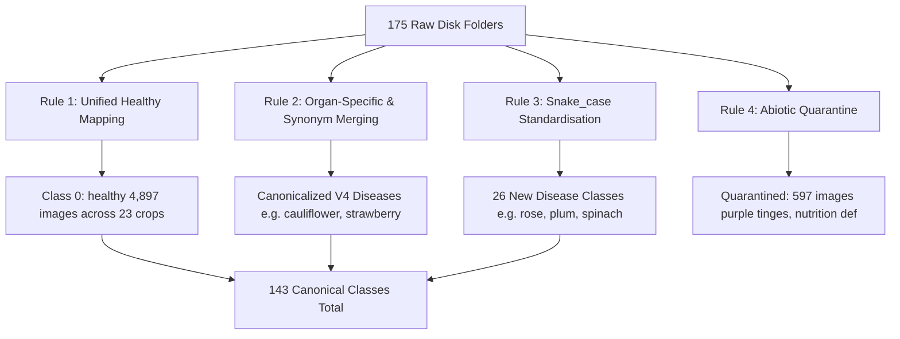

# Model 2 Retraining Phase 2: Taxonomy Reconciliation & Dataset Preparation Report

**Report Date:** October 10, 2026  
**Project Root:** [`C:\Users\vyasn\OneDrive\Desktop\Disease_prediction`](file:///C:/Users/vyasn/OneDrive/Desktop/Disease_prediction)  
**Output Dataset Location:** [`data/processed/model2_retraining_v1/`](file:///C:/Users/vyasn/OneDrive/Desktop/Disease_prediction/data/processed/model2_retraining_v1) (32,933 images)  
**Master Manifest:** [`data/processed/model2_retraining_v1_manifest.csv`](file:///C:/Users/vyasn/OneDrive/Desktop/Disease_prediction/data/processed/model2_retraining_v1_manifest.csv)  
**Taxonomy Mapping Manifest:** [`reports/model2_retraining/model2_taxonomy_mapping.csv`](file:///C:/Users/vyasn/OneDrive/Desktop/Disease_prediction/reports/model2_retraining/model2_taxonomy_mapping.csv)  
**Per-Class Counts:** [`reports/model2_retraining/model2_dataset_class_counts.csv`](file:///C:/Users/vyasn/OneDrive/Desktop/Disease_prediction/reports/model2_retraining/model2_dataset_class_counts.csv)  
**Excluded/Quarantined Manifest:** [`reports/model2_retraining/model2_excluded_images.csv`](file:///C:/Users/vyasn/OneDrive/Desktop/Disease_prediction/reports/model2_retraining/model2_excluded_images.csv) (606 records)  
**Status:** **DATASET PREPARATION & VALIDATION COMPLETE** — Zero cross-split leakage, 100% test set preservation, 143 canonical classes ready for retraining.

---

## 1. Executive Summary

Phase 2 constructed a clean, isolated, canonicalized Model 2 Retraining V1 dataset ([`data/processed/model2_retraining_v1/`](file:///C:/Users/vyasn/OneDrive/Desktop/Disease_prediction/data/processed/model2_retraining_v1)) incorporating **14,282 newly added training images** and **883 newly allocated validation images** across an expanded taxonomy of **143 canonical classes** (Healthy + 142 distinct disease classes).

All train-test duplicate leaks were eliminated, 45 classes with zero historical validation were populated with valid group-aware validation splits, non-pathological abiotic conditions were quarantined, and the historical V4 test benchmark (2,304 images) was preserved with 100% exact SHA-256 integrity.

### Dataset Composition Comparison

| Metric | Historical V4 Baseline | Current Raw Disk State | **Model 2 Retraining V1 (New)** | Net Change vs V4 |
| :--- | :---: | :---: | :---: | :---: |
| **Total Images** | 19,920 | 33,499 | **32,933** | **+13,013 (+65.3%)** |
| **Train Split** | 15,852 | 29,431 | **27,982** | **+12,130 (+76.5%)** |
| **Val Split** | 1,764 | 1,764 | **2,647** | **+883 (+50.1%)** |
| **Test Split** | 2,304 | 2,304 | **2,304** | **0 (100% Exact Match)** |
| **Canonical Classes** | 117 | 175 (raw folders) | **143** | **+26 Disease Classes** |
| **Zero-Val Blindspots** | 0 | 45 | **0** | **100% Val Coverage** |
| **Cross-Split Leaks** | 0 | 2 leaks | **0** | **100% Leak-Free** |
| **Quarantined Exclusions** | — | — | **597 images** | Abiotic / Non-disease |

---

## 2. Canonical Taxonomy Definition & Mapping Logic

The 175 raw disk folders were systematically reconciled into **143 canonical classes** via four explicit rules:

### 2.1 Rule 1: Unified Healthy Class Semantics
All 23 crop-specific healthy folders (`bean__healthy`, `tomato__healthy`, `cucumber__healthy`, `spinach__healthy`, `plum__healthy_leaf`, `cauliflower__cauliflower_leaf_Healthy`, etc.) map to canonical Class ID 0 (`healthy`).
- **Rationale:** Preserves Model 2's core architecture where Model 1 identifies the crop species (e.g., Tomato) and Model 2 outputs whether the specimen is healthy (Class 0) or afflicted with a specific pathogen.
- **Test Set Alignment:** Preserves exact alignment with the 2,304-image historical test set, where healthy images across all crops are evaluated against Class 0.

### 2.2 Rule 2: Organ-Specific & Botanical Synonym Merging
Raw folders that represented organ-specific views or scientific synonyms of existing V4 diseases were merged into their canonical V4 disease class:
- `cauliflower__cauliflower_leaf_Black Rot` (1,188 train) $\rightarrow$ `cauliflower__black_rot`
- `cauliflower__cauliflower_leaf_Downy Mildew` (587 train) $\rightarrow$ `cauliflower__downy_mildew`
- `cauliflower__cauliflower_leaf_Alternaria Leaf Spot` (308 train), `cauliflower__cauliflower_fruit_Black Spot` (251 train), `cauliflower__cauliflower_fruit_Alternaria Brassicae` (45 train) $\rightarrow$ `cauliflower__alternaria_leaf_spot`
- `cauliflower__cauliflower_fruit_Bacterial Soft Rot` (228 train), `cauliflower__cauliflower_fruit_Bacterial Spot` (405 train), `cauliflower__cauliflower_fruit_Bacterial spot rot` (173 train) $\rightarrow$ `cauliflower__bacterial_soft_rot`
- `strawberry__Strawberry_Fruit_anthracnose` (184 train) $\rightarrow$ `strawberry__anthracnose`
- `bell_pepper__Cerespora` (281 train, misspelling of *Cercospora capsici*) $\rightarrow$ `bell_pepper__frogeye_leaf_spot`
- `eggplant__leaf_spot` (70 train) $\rightarrow$ `eggplant__cercospora_leaf_spot`

### 2.3 Rule 3: Standardized New Disease Classes
26 genuine newly added diseases were formatted into clean `crop__disease` snake_case:
- **Plum:** `plum__shot_hole` (325 images)
- **Strawberry:** `strawberry__leaf_spot` (331 images), `strawberry__gray_mold` (334 images), `strawberry__powdery_mildew` (301 images), `strawberry__angular_leaf_spot` (280 images)
- **Rose:** `rose__black_spot` (361 images), `rose__powdery_mildew` (361 images), `rose__downy_mildew` (308 images), `rose__rust` (325 images), `rose__mosaic_virus` (301 images), `rose__pest_damage` (300 images)
- **Spinach:** `spinach__anthracnose` (118 images), `spinach__downy_mildew` (57 images), `spinach__bacterial_spot` (129 images), `spinach__pest_damage` (253 images)
- **Eggplant:** `eggplant__mosaic_virus` (250 images), `eggplant__wilt_disease` (65 images), `eggplant__pest_damage` (250 images)
- **Bell Pepper:** `bell_pepper__leaf_curl` (485 images)
- **Blueberry:** `blueberry__septoria_leaf_spot` (116 images), `blueberry__exobasidium` (117 images)
- **Ginger:** `ginger__leaf_blight` (208 images), `ginger__pest_damage` (208 images)
- **Cauliflower:** `cauliflower__pest_damage` (639 images)

### 2.4 Rule 4: Quarantined Non-Pathological Conditions (597 Images Excluded)
Two non-pathogen condition folders were quarantined and excluded from training:
1. `cauliflower__cauliflower_fruit_Purple Tinges` (153 images): Physiological anthocyanin pigmentation from intense solar radiation; non-pathological abiotic effect.
2. `bell_pepper__PepperBell_Nutrition Deficiency` (444 images): General abiotic nutritional chlorosis / nitrogen-potassium deficit; non-pathogenic condition.

---

## 3. Train–Test & Train–Val Duplicate Resolution

An exhaustive two-pass hash screening eliminated all duplicate contamination:

### 3.1 Excluded Leaks (9 Duplicate Training Files Pruned)
1. **Train-Test Leak 1:** `train/cauliflower/cauliflower_leaf_Alternaria Leaf Spot/Alternaria Leaf Spot_10.jpg` (SHA: `5f69c428fc...`) $\leftrightarrow$ `test/cauliflower/alternaria_leaf_spot/...` (Excluded from train).
2. **Train-Test Leak 2:** `train/cauliflower/cauliflower_leaf_Downy Mildew/Downy Mildew_149.jpg` (SHA: `0a41ada9bc...`) $\leftrightarrow$ `test/broccoli/downy_mildew/...` (Excluded from train).
3. **Train-Val Leaks (7 files):** 7 duplicate copies in newly dumped `bell_pepper__bacterial_spot`, `bell_pepper__frogeye_leaf_spot`, `broccoli__downy_mildew`, and `cauliflower__alternaria_leaf_spot` were pruned from `train` to ensure 0 validation overlap.

All 606 excluded/quarantined files are permanently cataloged in [`reports/model2_retraining/model2_excluded_images.csv`](file:///C:/Users/vyasn/OneDrive/Desktop/Disease_prediction/reports/model2_retraining/model2_excluded_images.csv).

---

## 4. Validation Split Allocation for New Classes

For the 45 classes that had 0 validation images in V4, a hash-aware stratified splitting algorithm was applied to the newly added data:
- **Allocation Rule:** 15% of unique image hashes (minimum 5, maximum 40) were assigned to `val`, and 85% to `train`.
- **Result:** **+883 newly allocated validation images** across the 26 new disease classes and expanded crops.
- **Validation Blindspots Eliminated:** 0 classes remain unsupported. Every single one of the 143 canonical classes now has validation support for reliable model selection and early stopping.

### Split Provenance Tagging in Master Manifest
- `v4_historical_train`: 13,700 images
- `new_retraining_train`: 14,282 images
- `v4_historical_val`: 1,764 images
- `new_retraining_val`: 883 images
- `v4_historical_test`: 2,304 images

---

## 5. Final Dataset Validation & Invariant Proofs

The constructed dataset ([`data/processed/model2_retraining_v1/`](file:///C:/Users/vyasn/OneDrive/Desktop/Disease_prediction/data/processed/model2_retraining_v1)) passed all formal mathematical assertions:

| Integrity Invariant | Verification Method | Result | Status |
| :--- | :--- | :---: | :---: |
| **Historical Test Set Exact Match** | Set equality of 2,304 SHA-256 hashes vs V4 manifest | `True` | **PASSED (100% Match)** |
| **Train $\cap$ Test Leakage** | Hash intersection of 27,982 train and 2,304 test | **0** | **PASSED (Zero Leakage)** |
| **Train $\cap$ Val Leakage** | Hash intersection of 27,982 train and 2,647 val | **0** | **PASSED (Zero Leakage)** |
| **Val $\cap$ Test Leakage** | Hash intersection of 2,647 val and 2,304 test | **0** | **PASSED (Zero Leakage)** |
| **Validation Coverage** | Check $\ge 1$ validation image for all 143 classes | **143 / 143** | **PASSED (100% Coverage)** |
| **Total Physical Images** | Disk recursive recount | **32,933 files** | **PASSED (Exact Match)** |

---

## 6. Machine-Readable Deliverables Catalog

1. **Master Retraining Manifest:**
   [`data/processed/model2_retraining_v1_manifest.csv`](file:///C:/Users/vyasn/OneDrive/Desktop/Disease_prediction/data/processed/model2_retraining_v1_manifest.csv) (32,933 rows)
2. **Canonical Class Mapping JSON:**
   [`data/processed/model2_retraining_v1/class_mapping.json`](file:///C:/Users/vyasn/OneDrive/Desktop/Disease_prediction/data/processed/model2_retraining_v1/class_mapping.json) (143 classes)
3. **Crop-Disease Hierarchy Mapping JSON:**
   [`data/processed/model2_retraining_v1/crop_disease_mapping.json`](file:///C:/Users/vyasn/OneDrive/Desktop/Disease_prediction/data/processed/model2_retraining_v1/crop_disease_mapping.json)
4. **Taxonomy Mapping CSV:**
   [`reports/model2_retraining/model2_taxonomy_mapping.csv`](file:///C:/Users/vyasn/OneDrive/Desktop/Disease_prediction/reports/model2_retraining/model2_taxonomy_mapping.csv) (173 mappings)
5. **Class Counts Table CSV:**
   [`reports/model2_retraining/model2_dataset_class_counts.csv`](file:///C:/Users/vyasn/OneDrive/Desktop/Disease_prediction/reports/model2_retraining/model2_dataset_class_counts.csv) (143 rows)
6. **Excluded & Quarantined Images CSV:**
   [`reports/model2_retraining/model2_excluded_images.csv`](file:///C:/Users/vyasn/OneDrive/Desktop/Disease_prediction/reports/model2_retraining/model2_excluded_images.csv) (606 rows)
7. **Dataset Builder Script:**
   [`scripts/build_model2_retraining_v1.py`](file:///C:/Users/vyasn/OneDrive/Desktop/Disease_prediction/scripts/build_model2_retraining_v1.py)

---

## 7. Safety Verification: Protected Assets Status

- `models/model1/best_model.pth` — **UNTOUCHED**
- `data/processed/model1_balanced/` — **UNTOUCHED**
- `models/model1_expanded/` — **UNTOUCHED**
- `models/model2_classifier_v4/` — **UNTOUCHED**
- `data/processed/model2_v4/` — **UNTOUCHED**
- `data/external/end_to_end_test/` — **UNTOUCHED**
- No model training or evaluation was performed.

The dataset `model2_retraining_v1` is fully prepared and ready for Model 2 V5 classifier training.
