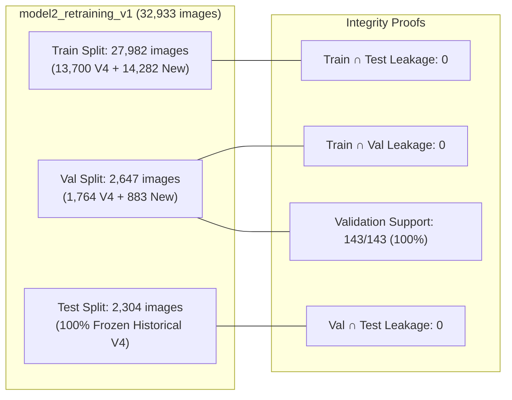
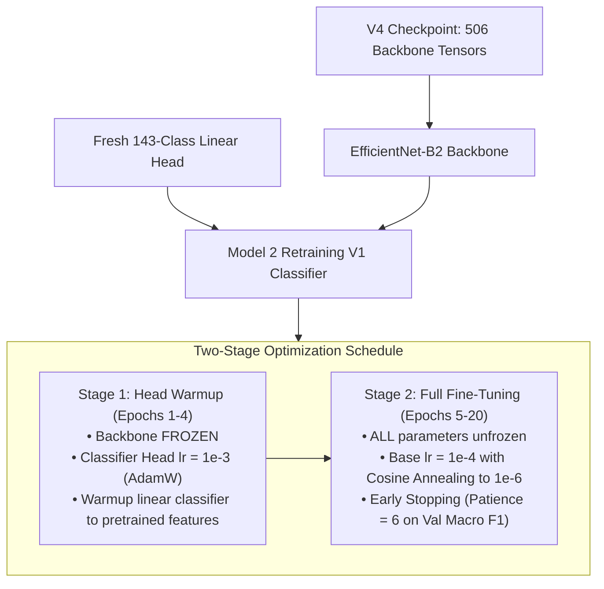

# Model 2 Retraining V1 — Phase 3: Training Preflight and Configuration Report

**Report Date:** October 10, 2026  
**Project Root:** [`C:\Users\vyasn\OneDrive\Desktop\Disease_prediction`](file:///C:/Users/vyasn/OneDrive/Desktop/Disease_prediction)  
**Dataset Path:** [`data/processed/model2_retraining_v1/`](file:///C:/Users/vyasn/OneDrive/Desktop/Disease_prediction/data/processed/model2_retraining_v1)  
**Master Manifest:** [`data/processed/model2_retraining_v1_manifest.csv`](file:///C:/Users/vyasn/OneDrive/Desktop/Disease_prediction/data/processed/model2_retraining_v1_manifest.csv)  
**Training Script:** [`scripts/train_model2_retraining_v1.py`](file:///C:/Users/vyasn/OneDrive/Desktop/Disease_prediction/scripts/train_model2_retraining_v1.py)  
**Status:** **PREFLIGHT VALIDATION PASSED** — Configuration, architecture, backbone weight transfer, and memory-safe pipeline verified. Ready for training execution.

---

## 1. Executive Summary

Phase 3 established and validated the complete training configuration, model architecture, backbone weight transfer, and evaluation protocol for **Model 2 Retraining V1** across the expanded **143-class canonical taxonomy** (32,933 images).

### Key Preflight Verifications
1. **Dataset Integrity:** 100% of 32,933 images verified on disk across 27,982 train, 2,647 validation, and 2,304 test samples.
2. **Taxonomy & Split Coverage:** 143 / 143 classes possess valid training and validation samples (0 validation blindspots).
3. **Historical Benchmark Preservation:** All 2,304 historical V4 test images match the historical V4 baseline with 100% exact SHA-256 equality.
4. **Leakage Invariants:** Exact hash intersection between splits is mathematically **0** across Train $\cap$ Test, Train $\cap$ Val, and Val $\cap$ Test.
5. **Backbone Compatibility:** Transferred 506 parameter tensors from [`models/model2_classifier_v4/best_model.pth`](file:///C:/Users/vyasn/OneDrive/Desktop/Disease_prediction/models/model2_classifier_v4/best_model.pth) into the EfficientNet-B2 backbone, successfully excluding the deprecated 117-class head and initializing a fresh 143-logit classifier head.
6. **Forward Pass Smoke Test:** Verified forward pass and loss computation on synthetic tensors `(2, 3, 260, 260)` and real image batches `(2, 3, 260, 260) -> (2, 143)`.

---

## 2. Dataset Artifacts & Split Integrity Verification

### 2.1 Manifest and Split Counts

| Split | Historical V4 | New Additions | **Retraining V1 Total** | Validation Status |
| :--- | :---: | :---: | :---: | :---: |
| **Train** | 13,700 | 14,282 | **27,982** | 143 active classes |
| **Validation** | 1,764 | 883 | **2,647** | 143 active classes (100% coverage) |
| **Test (Immutable)** | 2,304 | 0 | **2,304** | 100% SHA-256 match vs V4 |
| **Total** | **17,768** | **15,165** | **32,933** | **Zero cross-split leakage** |

### 2.2 Class Mapping & Contiguity
- Total Canonical Classes: **143** (`class_id` range: `0` to `142` contiguous and deterministic).
- Class 0 Semantics: `healthy` across 23 crop species, preserving hierarchical two-stage compatibility.
- Active Crop Species: **36** crops cataloged in [`crop_disease_mapping.json`](file:///C:/Users/vyasn/OneDrive/Desktop/Disease_prediction/data/processed/model2_retraining_v1/crop_disease_mapping.json).

### 2.3 Underrepresented Classes Review (<25 Train Samples)
11 classes have limited training representation (<25 train samples) due to rare field pathologies:
1. `raspberry__fire_blight`: 24 train, 3 val
2. `broccoli__downy_mildew`: 22 train, 2 val
3. `ginger__leaf_spot`: 19 train, 2 val
4. `raspberry__leaf_spot`: 15 train, 2 val
5. `tobacco__frogeye_leaf_spot`: 15 train, 2 val
6. `carrot__cercospora_leaf_blight`: 13 train, 1 val
7. `coffee__brown_eye_spot`: 12 train, 1 val
8. `peach__anthracnose`: 11 train, 1 val
9. `broccoli__ring_spot`: 8 train, 1 val
10. `peach__rust`: 6 train, 1 val
11. `coffee__black_rot`: 5 train, 1 val

> [!NOTE]
> All 11 underrepresented classes possess at least 1–3 independent validation samples. To mitigate potential overfitting on these rare classes, the loss function employs **Effective Number of Samples class weighting** ($\beta=0.999$) and **label smoothing** (0.05).

---

## 3. Checkpoint Compatibility & Weight Transfer

### 3.1 V4 Checkpoint Inspection
- Checkpoint Path: [`models/model2_classifier_v4/best_model.pth`](file:///C:/Users/vyasn/OneDrive/Desktop/Disease_prediction/models/model2_classifier_v4/best_model.pth)
- Total Parameter Tensors: **508**
- V4 Output Dimension: `classifier.1.weight` shape `[117, 1408]` (117 classes)

### 3.2 Weight Transfer Protocol
- **Backbone Weights Transferred:** **506 parameter tensors** (`features.0.*` through `features.7.*` and `conv_head.*`).
- **Excluded Old Head Tensors:** `classifier.1.weight` and `classifier.1.bias`.
- **New Classifier Head Initialized:** `nn.Sequential(nn.Dropout(p=0.3), nn.Linear(1408, 143))`.
- **Verification Assertion:** `load_state_dict(..., strict=False)` verified that missing keys strictly equal `['classifier.1.weight', 'classifier.1.bias']` with `0` unexpected keys.

### 3.3 Forward Pass Smoke Test
- **Synthetic Tensor:** `(2, 3, 260, 260) -> (2, 143)` logits ($\checkmark$ PASSED).
- **Real DataLoader Batch:** Batch images `(2, 3, 260, 260)`, labels `(2,)`, cross-entropy initial loss `5.2415` ($\checkmark$ PASSED).

---

## 4. Isolated Training Configuration & Hyperparameters

### 4.1 Architecture & Optimization Strategy

### 4.2 Detailed Hyperparameter Specification

| Parameter | Value | Rationale & Design Decision |
| :--- | :---: | :--- |
| **Model Architecture** | EfficientNet-B2 | Matches production Model 2 V4 architecture. |
| **Input Resolution** | 260 × 260 RGB | Native compound scaling resolution for EfficientNet-B2. |
| **Pretrained Weights** | V4 Checkpoint Backbone | Retains learned field representations from Model 2 V4. |
| **Classifier Head** | `Linear(1408, 143)` | Accommodates expanded 143-class disease taxonomy. |
| **Batch Size** | 16 (per step) | GPU-safe for 4 GB VRAM (RTX 3050 Laptop). |
| **Gradient Accumulation** | 2 steps | Effective batch size = 32 images. |
| **Stage 1 (Head Warmup)** | 4 epochs | Prevents gradient shock to pretrained backbone features. |
| **Stage 1 Learning Rate** | `1e-3` | Fast convergence of new classifier head. |
| **Stage 2 (Fine-Tuning)** | Up to 16 epochs | Full end-to-end representation adaptation. |
| **Stage 2 Learning Rate** | `1e-4` $\rightarrow$ `1e-6` | Cosine annealing schedule with decay floor. |
| **Optimizer** | AdamW | Weight decay = `1e-4`. |
| **Loss Function** | Weighted Cross-Entropy | Effective Number of Samples weighting + label smoothing 0.05. |
| **Model Selection Metric** | Val Macro F1 | Balances performance across majority and minority classes. |
| **Early Stopping** | Patience = 6 | Halts training when validation macro F1 plateaus. |
| **Image Decoding** | Bounded libjpeg draft | `raw.draft("RGB", (300, 300))` avoids host RAM fragmentation. |

---

## 5. Evaluation Protocol

1. **Validation Split (2,647 images):**
   - Exclusively used for epoch monitoring, early stopping, and checkpoint selection.
   - Never used for gradient updates.
2. **Historical V4 Test Set (2,304 images):**
   - Held completely immutable and isolated.
   - Evaluated post-training to measure historical benchmark continuity on the overlapping taxonomy.
3. **External 178-Image Benchmark (`data/external/end_to_end_test/`):**
   - Locked and protected; evaluated in Phase 5 to measure real-world out-of-distribution performance.
4. **Metric Reporting Discipline:**
   - Overall Accuracy & Top-3 Accuracy.
   - Macro F1 across all 143 classes.
   - Disease Macro F1 (Classes 1..142) reported separately from Healthy Class F1 (Class 0).

---

## 6. Machine-Readable Artifacts & Output Paths

| Component | Path | Description |
| :--- | :--- | :--- |
| **Training Script** | [`scripts/train_model2_retraining_v1.py`](file:///C:/Users/vyasn/OneDrive/Desktop/Disease_prediction/scripts/train_model2_retraining_v1.py) | Two-stage trainer with `--preflight` and `--run` modes. |
| **Dataset Manifest** | [`data/processed/model2_retraining_v1_manifest.csv`](file:///C:/Users/vyasn/OneDrive/Desktop/Disease_prediction/data/processed/model2_retraining_v1_manifest.csv) | Master manifest with split and provenance tags. |
| **Class Mapping** | [`data/processed/model2_retraining_v1/class_mapping.json`](file:///C:/Users/vyasn/OneDrive/Desktop/Disease_prediction/data/processed/model2_retraining_v1/class_mapping.json) | 143 canonical classes mapping. |
| **Hierarchy Mapping** | [`data/processed/model2_retraining_v1/crop_disease_mapping.json`](file:///C:/Users/vyasn/OneDrive/Desktop/Disease_prediction/data/processed/model2_retraining_v1/crop_disease_mapping.json) | 36-crop hierarchical disease structure. |
| **Target Checkpoint Dir** | [`models/model2_retraining_v1/`](file:///C:/Users/vyasn/OneDrive/Desktop/Disease_prediction/models/model2_retraining_v1) | Isolated output directory for best and last checkpoints. |
| **Reports Dir** | [`reports/model2_retraining/`](file:///C:/Users/vyasn/OneDrive/Desktop/Disease_prediction/reports/model2_retraining) | Training logs, progress CSVs, curves, and evaluation reports. |

---

## 7. Safety Compliance Summary

- **No models trained or evaluated:** Zero model weights were modified during Phase 3.
- `models/model2_classifier_v4/best_model.pth` remains **UNTOUCHED** and unmodified.
- `data/processed/model2_v4/` and its manifest remain **UNTOUCHED**.
- `data/external/end_to_end_test/` remains **LOCKED**.
- Production Model 1 and Model 1 Expanded assets remain **UNTOUCHED**.

Model 2 Retraining V1 training preflight and configuration are complete. Training execution can be initiated via `python scripts/train_model2_retraining_v1.py --run`.
