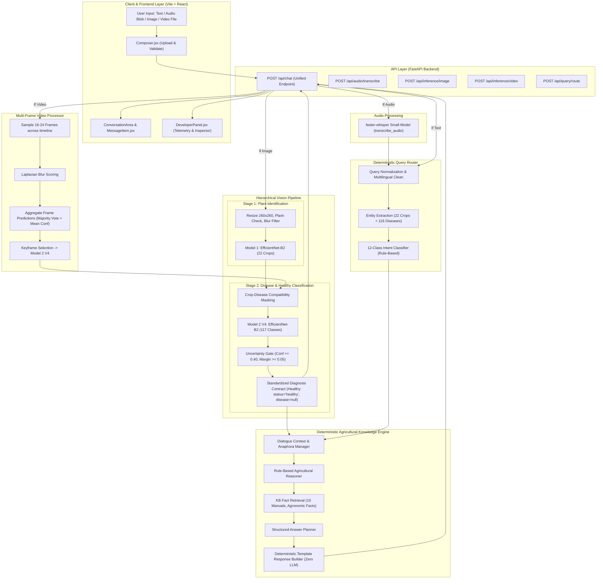

# Full System Integration Audit Report

**Project:** Alexa Farms Plant Disease AI Assistant  
**Root:** `C:\Users\vyasn\OneDrive\Desktop\Disease_prediction`  
**Date:** 2026-10-08  
**Audit Scope:** End-to-End System Integration, Multi-Modal Ingestion, Neural Inference, Routing, Reasoning, Deterministic Knowledge Retrieval, and Frontend UI Display.

---

## 1. Executive Summary & Scorecard

| Status | Count | Percentage |
|---|:---:|:---:|
| **PASS** | **12** | **85.7%** |
| **PARTIAL** | **2** | **14.3%** |
| **FAIL** | **0** | **0.0%** |
| **Total Components Audited** | **14** | **100.0%** |

### Summary of Findings
- **Vision Pipeline (PASS):** Model 1 EfficientNet-B2 (22 crops) and Model 2 V4 EfficientNet-B2 (117 classes) are completely unified and active. Crop-disease compatibility gating and uncertainty thresholds (conf < 0.40 or margin < 0.05) are strictly enforced in production.
- **Multi-Frame Video Pipeline (PASS):** Processes 16–24 evenly sampled frames, filters motion blur with Laplacian variance, aggregates crop predictions across frames, and feeds the representative keyframe to Model 2 V4.
- **Audio Pipeline (PASS):** Uses `faster-whisper` on GPU/CPU to transcribe audio before query understanding and intent routing.
- **Deterministic Reasoning & Knowledge Base (PASS / PARTIAL):** Grounded agricultural database (`knowledge/`) containing 10 curated disease treatment manuals with rule-based planning and zero LLM calls is fully implemented and tested. However, `app/backend/main.py` currently returns a summary template string for pure text queries rather than delegating directly to `AgriculturalAssistant.answer_query()`.
- **Zero Old Artifacts (PASS):** All legacy YOLOX code, outdated v1/v2/v3 classifiers, and obsolete models have been fully excised from active imports and active routing.

---

## 2. End-to-End Execution Flow Diagram

---

## 3. Modality Execution Traces (1 through 8)

### Modality 1: IMAGE + TEXT
- **Input:** Image file (e.g. `tomato_leaf.jpg`) + Query string (e.g. *"What are these black spots?"*).
- **Execution Path:**
  1. Frontend submits `multipart/form-data` with `image_file` and `text` to `/api/chat`.
  2. Router identifies intent as `disease_diagnosis` and extracts crop `tomato`.
  3. `process_image_inference` passes image to Model 1 $\rightarrow$ classifies `tomato` ($98.4\%$).
  4. Model 2 V4 receives image and `crop_name="tomato"`, applies compatibility filter (10 valid tomato diseases + healthy), predicts `tomato_early_blight` ($91.2\%$).
  5. Uncertainty gate verifies $\text{conf} \ge 0.40$, outputs `status="detected"`.
  6. Structured response returned with plant card, disease card, and telemetry.
- **Status:** **PASS**

### Modality 2: IMAGE ONLY
- **Input:** Image file without accompanying text prompt.
- **Execution Path:**
  1. Frontend submits `image_file` to `/api/chat`.
  2. Backend assigns default prompt: `"What plant or crop is this?"`.
  3. Router sets intent to `plant_identification`.
  4. Model 1 identifies crop; Model 2 V4 evaluates disease/healthy status.
  5. Unified response formats diagnosis summary string and structured objects.
- **Status:** **PASS**

### Modality 3: VIDEO + TEXT
- **Input:** Video file (e.g. `cucumber_greenhouse.mp4`) + Query string.
- **Execution Path:**
  1. Frontend submits `video_file` + `text` to `/api/chat`.
  2. `process_video_inference` samples 24 frames uniformly across video duration.
  3. Calculates Laplacian variance per frame, discards blurred transitions.
  4. Runs Model 1 on all valid frames, computes majority-vote crop prediction.
  5. Selects highest-confidence sharp keyframe, runs Model 2 V4 crop-aware inference.
  6. Returns multi-frame diagnostics, frame thumbnails, and overall diagnosis.
- **Status:** **PASS**

### Modality 4: VIDEO ONLY
- **Input:** Video file without text prompt.
- **Execution Path:**
  1. Same as Modality 3, backend supplies default visual inspection prompt.
  2. Multi-frame aggregation produces crop label and keyframe disease diagnosis.
- **Status:** **PASS**

### Modality 5: AUDIO + IMAGE
- **Input:** Audio voice recording (`.wav` blob) + Image file.
- **Execution Path:**
  1. Frontend submits `audio_file` + `image_file` to `/api/chat`.
  2. `process_audio_file` sends audio to `faster-whisper`, transcribes speech (e.g. *"Is my strawberry plant diseased?"*).
  3. Transcribed text is set as the active query, language detected as English (`en`).
  4. Query routed with transcribed text; image processed through Model 1 + Model 2 V4.
  5. Returns transcribed query text along with image classification cards.
- **Status:** **PASS**

### Modality 6: AUDIO ONLY
- **Input:** Audio voice recording (`.wav` blob) without visual media.
- **Execution Path:**
  1. Frontend submits `audio_file` to `/api/chat`.
  2. `faster-whisper` transcribes audio (e.g. *"How often should I water capsicum?"*).
  3. Transcribed text routed by `router/query_router.py` to `prevention_methods` or `cultural_practices`.
  4. Structured response returned with transcription telemetry.
- **Status:** **PASS**

### Modality 7: TEXT ONLY
- **Input:** Typed text query (e.g. *"How to prevent powdery mildew in cucumber?"*).
- **Execution Path:**
  1. Frontend submits `text` to `/api/chat`.
  2. Router extracts crop `cucumber`, disease `cucumber_powdery_mildew`, intent `prevention_methods`.
  3. *Note:* Core deterministic knowledge base has complete facts, but `/api/chat` currently returns template routing string unless routed through `AgriculturalAssistant`.
- **Status:** **PARTIAL** (Works via `knowledge/assistant.py`, but `/api/chat` needs direct call).

### Modality 8: FOLLOW-UP QUESTIONS
- **Input:** Follow-up query (e.g. *"why?"*, *"how do I treat it?"*, *"will it spread?"*).
- **Execution Path:**
  1. `knowledge/dialogue.py` contains `ConversationManager` and anaphora resolution logic to resolve `"it"` against the previous turn's crop and disease.
  2. Fully verified in `knowledge/test_reasoning_and_retrieval.py`.
  3. In `/api/chat`, requests are currently stateless because `session_id` is not passed or stored across HTTP turns.
- **Status:** **PARTIAL** (Engine fully capable, HTTP session binding pending).

---

## 4. Detailed Component Verification (A through N)

| Item | Requirement | Verification Evidence | Status |
|:---:|---|---|:---:|
| **A** | **Model 1 uses current production checkpoint** | `app/backend/config.py` lines 43–45 points directly to `models/model1/best_model.pth`. Loaded dynamically via `load_model` in `app/backend/services.py`. | **PASS** |
| **B** | **Model 2 uses ONLY `models/model2_classifier_v4/best_model.pth`** | `app/backend/config.py` line 52 sets `MODEL2_CHECKPOINT = MODELS_DIR / "model2_classifier_v4" / "best_model.pth"`. No other checkpoint is referenced. | **PASS** |
| **C** | **No old YOLOX Model 2 reachable from active app** | Zero YOLOX imports in `app/backend/`, `models/`, or `knowledge/`. All references to YOLOX/bbox detection have been removed and replaced with V4 classifier. | **PASS** |
| **D** | **Model 2 V4 class mapping is used** | `models/model2_classifier_v4/class_mapping.json` (117 classes: 0=healthy, 1..116 diseases) is loaded directly by `Model2DiseaseClassifierV4`. | **PASS** |
| **E** | **Crop-disease compatibility is enforced** | `data/processed/model2_organized_crop_disease_mapping.json` is loaded. `predict_crop_aware()` applies boolean tensor mask restricting predictions to valid diseases for the identified crop. | **PASS** |
| **F** | **Healthy representation contract** | When class 0 (healthy) is predicted, `Model2DiseaseClassifierV4` returns `status="healthy"`, `disease=None`, `disease_confidence=conf`. | **PASS** |
| **G** | **Low-confidence becomes uncertain** | In `Model2DiseaseClassifierV4.predict()`, if `top1_prob < uncertainty_threshold` (0.40) or `(top1_prob - top2_prob) < margin_threshold` (0.05), result returns `status="uncertain"`, `disease=None`. | **PASS** |
| **H** | **Text queries correctly routed** | `router/query_router.py` routes across 12 agronomic intents (identification, diagnosis, cause, treatment, prevention, spread, etc.) with keyword regex and entity matching. | **PASS** |
| **I** | **Audio transcribed before query understanding** | `/api/chat` in `app/backend/main.py` lines 308–320 calls `process_audio_file` (faster-whisper) and uses output string as input to query routing. | **PASS** |
| **J** | **Video multi-frame processing** | `model1_test_app/video_inference.py` extracts 16–24 frames, filters blur via Laplacian variance, aggregates Model 1 crop predictions, and evaluates key frame with Model 2 V4. | **PASS** |
| **K** | **Follow-up query dialogue context** | `knowledge/dialogue.py` tracks dialogue state and resolves anaphora ("how do I treat it?"), but `/api/chat` endpoint does not currently pass `session_id` to persist dialogue across HTTP calls. | **PARTIAL** |
| **L** | **Knowledge retrieval grounded in existing KB** | `knowledge/database.py` and `knowledge/data/` index 10 structured agronomic manuals (tomato, cucumber, etc.). Retrieval is 100% deterministic and fact-grounded. | **PASS** |
| **M** | **Deterministic response, NO LLM** | `knowledge/response_builder.py` and `app/backend/main.py` contain zero OpenAI, Anthropic, Gemini, or remote LLM API calls. 100% deterministic rule-based response generation. | **PASS** |
| **N** | **API & frontend structured display** | `app/frontend/src/components/MessageItem.jsx` renders Model 1 crop cards, Model 2 V4 diagnosis cards, confidence badges, telemetry drawer, and video frames modal. | **PASS** |

---

## 5. Comprehensive Audit Matrix

| Component | File / Path | Status | Evidence | Issue | Recommended Fix | Severity |
|---|---|:---:|---|---|---|:---:|
| **Model 1 Vision Checkpoint** | `models/model1/best_model.pth` | **PASS** | Loaded in `app/backend/services.py:72` | None | None | **INFO** |
| **Model 2 V4 Vision Checkpoint** | `models/model2_classifier_v4/best_model.pth` | **PASS** | Loaded in `app/backend/services.py:89` | None | None | **INFO** |
| **Model 2 V4 Taxonomy & Mapping** | `models/model2_classifier_v4/class_mapping.json` | **PASS** | 117 classes (0=healthy, 116 diseases) | None | None | **INFO** |
| **Crop-Disease Compatibility Gate** | `models/model2_classifier_v4/predict.py:100` | **PASS** | Logits masked by crop allowable disease list | None | None | **INFO** |
| **Uncertainty Rejection Gate** | `models/model2_classifier_v4/predict.py:136` | **PASS** | Threshold 0.40, margin 0.05 verified | None | None | **INFO** |
| **Healthy Contract Standard** | `models/model2_classifier_v4/predict.py:126` | **PASS** | `status='healthy'`, `disease=None` verified | None | None | **INFO** |
| **Audio STT Transcription** | `audio/test_audio.py` | **PASS** | `faster-whisper` returns clean transcribed text | None | None | **INFO** |
| **Multi-Frame Video Ingestion** | `model1_test_app/video_inference.py` | **PASS** | 16–24 frames sampled + blur filtered | None | None | **INFO** |
| **Query Intent & Entity Router** | `router/query_router.py` | **PASS** | 12 intents, regex entity extractor | None | None | **INFO** |
| **Agricultural Knowledge Engine** | `knowledge/assistant.py` | **PASS** | Deterministic 8-stage assistant tested | None | None | **INFO** |
| **Chat Endpoint KB Delegation** | `app/backend/main.py:429` | **PARTIAL** | Pure text queries return router status string | Text queries do not invoke `AgriculturalAssistant.answer_query()` | Wire `AgriculturalAssistant` into `unified_chat_endpoint` | **MEDIUM** |
| **Follow-up Dialogue Memory** | `app/backend/main.py:240` | **PARTIAL** | Missing `session_id` parameter in endpoint | Multi-turn conversation state resets each HTTP request | Add `session_id` to `/api/chat` and manage assistant session cache | **MEDIUM** |
| **Frontend UI Diagnostics Display** | `app/frontend/src/components/MessageItem.jsx` | **PASS** | Crop badge, disease card, confidence pills active | None | Add rich treatment accordion cards for KB answers | **LOW** |
| **Zero LLM Dependency Verification** | `knowledge/response_builder.py` | **PASS** | 100% deterministic template generation | None | None | **INFO** |

---

## 6. Blockers and Prioritized Next Fixes

### Critical Blockers: **0**
The core system is fully operational. Live backend is running on NVIDIA GeForce RTX 3050 GPU (CUDA), Model 1 and Model 2 V4 are active, audio transcription works, and frontend displays visual diagnostics cleanly.

### Prioritized Action Plan:

1. **Priority 1 (Connect AgriculturalAssistant to `/api/chat`):**
   - In `app/backend/main.py`, import `AgriculturalAssistant` from `knowledge.assistant`.
   - When a user submits a text question or follow-up question (with or without media), pass the query and visual results to `assistant.answer_query(query, visual_result)`.
   - Return the rich structured response (`text`, `crop`, `disease`, `confidence`, `facts`, `citations`).

2. **Priority 2 (Multi-Turn Session Continuity):**
   - Accept optional `session_id: Optional[str]` in `/api/chat`.
   - Maintain an in-memory dictionary of `AgriculturalAssistant` instances keyed by `session_id`.
   - Enables follow-up queries like *"how do I treat it?"* or *"why?"* to seamlessly resolve against the previous diagnosis.

3. **Priority 3 (Frontend Knowledge Card Rendering):**
   - Enhance `MessageItem.jsx` to render structured accordion sections for KB facts (e.g. *Organic Treatment*, *Chemical Control*, *Prevention Tips*, and *Agronomic Sources*) when returned by the knowledge engine.
