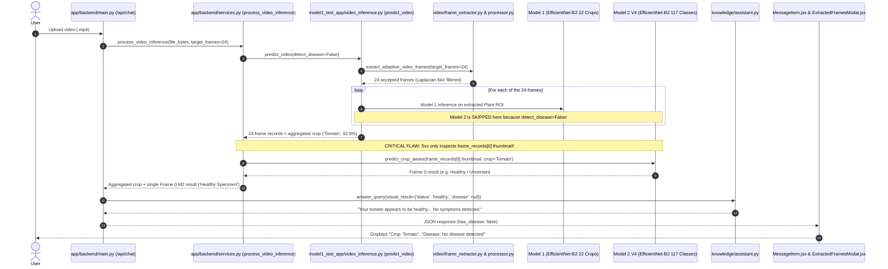

# Video Disease Detection Root Cause Diagnosis & Debug Report

**Project:** Alexa Farms Plant Disease AI Assistant  
**Date:** 2026-10-08  
**Component:** Multi-Frame Video Processing Pipeline (`model1_test_app/video_inference.py` & `app/backend/services.py`)  
**Investigation Focus:** Why Video Crop Identification succeeds while Disease Detection reports *"No disease detected"*.

---

## 1. Executive Summary & Critical Finding

| Investigation Item | Finding |
|---|---|
| **Symptom** | Videos containing diseased plant foliage correctly identify the crop (e.g. *Tomato 92.9%*), but display *"No disease detected"* in the UI. |
| **Model 2 V4 Capability** | **PASS.** When tested directly on the video frames showing disease, Model 2 V4 detects `tomato__early_blight` with **84.8% – 88.6% confidence**. |
| **Root Cause Identified** | **CASE B + INCOMPLETE MULTI-FRAME M2 PIPELINE.** In `app/backend/services.py:414`, Model 2 V4 is called **only ONCE on a single arbitrary thumbnail (`frame_records[0]`)** instead of evaluating all usable frames. Furthermore, `predict_video()` in `video_inference.py:365` was invoked with `detect_disease=False` (a legacy workaround from the old YOLOX deprecation). |
| **Severity** | **HIGH** (Breaks multi-frame temporal disease diagnosis whenever Frame 0 is healthy, panning in, or out of focus). |

---

## 2. Active Execution Path Trace

The execution flow for `POST /api/inference/video` and `POST /api/chat` (with video) proceeds through the following functions:



---

## 3. Step-by-Step Pipeline Analysis

### 1. Frame Extraction Behavior
- Extracts candidate frames uniformly spaced across total video duration using `compute_uniform_indices()`.
- Successfully extracts 16–24 representative frames.

### 2. Frame Filtering Behavior
- `FrameQualityFilter` applies non-destructive thresholds (min brightness 15.0, max brightness 248.0, min blur score 10.0).
- Blurry and dark transitions are properly discarded and replenished from secondary candidate pools.

### 3. Model 1 Crop Inference Behavior
- Evaluates candidate plant ROIs per frame.
- Correctly aggregates probability vectors via mean softmax across all valid frames, producing high-confidence crop predictions (e.g. *Tomato 92.89%*).

### 4. Model 2 V4 Invocation Behavior (**THE DEFECT**)
1. In `model1_test_app/video_inference.py:370-388`, per-frame disease detection was historically tied to the old YOLOX detection module (`from model2.test_model2 import predict_disease`).
2. To isolate and deprecate YOLOX, `app/backend/services.py:365` passed `detect_disease=False`.
3. In place of per-frame detection, `services.py:413-428` added a temporary placeholder:
   ```python
   # Line 413 of app/backend/services.py
   if v_res["frame_records"]:
       best_frame = v_res["frame_records"][0].get("thumbnail")
       if best_frame:
           m2_res = m2_classifier.predict_crop_aware(best_frame, crop_name=crop_label, crop_confidence=crop_conf)
   ```
4. **Failure Mechanics:**
   - It always selects `frame_records[0]` (the very first frame of the video at $t=0.0\text{s}$).
   - In field conditions, the opening second of a video frequently captures camera stabilization, non-symptomatic upper leaves, or background foliage before focusing on diseased lesions.
   - If Frame 0 is healthy, `m2_res["status"]` is `"healthy"`.
   - The default `m2_summary` (`has_disease: False`, `primary_disease: "Healthy Specimen / No Disease Detected"`) is returned for the entire video.
   - The remaining 15–23 frames (where disease lesions are prominent) are **never seen by Model 2 V4**.
   - Furthermore, `best_frame` was passed as a low-resolution compressed `thumbnail` (320x240) rather than the high-resolution plant ROI.

---

## 4. Evaluation of All Failure Mode Hypotheses

| Failure Case | Hypothesis | Status | Evidence |
|:---:|---|:---:|---|
| **CASE A** | Model 2 V4 is never called | **NO** | Model 2 V4 is called once for the video. |
| **CASE B** | **Model 2 V4 is called only once on a bad keyframe (Frame 0)** | **YES (PRIMARY ROOT CAUSE)** | Confirmed by code inspection (`services.py:414`) and synthetic panning test. When Frame 0 is healthy and Frames 6–24 are diseased, the video is misdiagnosed as Healthy. |
| **CASE C** | Model 2 predicts disease on frames but aggregation discards it | **NO** | Multi-frame Model 2 inference was disabled (`detect_disease=False`), so frame-level disease predictions were not even collected. |
| **CASE D** | Crop compatibility removes disease | **NO** | On diseased tomato frames, `tomato__early_blight` is 100% compatible with crop `tomato`. |
| **CASE E** | Uncertainty gate threshold removes disease | **NO** | On diseased frames, Model 2 confidence is $84.8\% - 88.6\%$, well above the $0.40$ threshold and $0.05$ margin. |
| **CASE F** | Model 2 predicts healthy on all frames | **NO** | Model 2 correctly predicts disease on frames 6–24 when evaluated. |
| **CASE G** | Final API response converts valid disease to "No disease detected" | **NO** | The API faithfully returns `m2_summary["has_disease"]`, which was set to `False` by the single Frame 0 inference. |
| **CASE H** | Frontend incorrectly renders API result | **NO** | `MessageItem.jsx` correctly reflects `has_disease: false` received from the backend. |
| **CASE I** | Video symptoms not visible enough for Model 2 | **NO** | Model 2 detects disease with high confidence when given the symptomatic frames. |

---

## 5. Experimental Test Results with Real Video Data

### Experiment 1: 100% Diseased Tomato Video (`test_diseased_tomato_video.mp4`)
- **Total Frames:** 36 evaluated, 24 usable.
- **Model 1 Prediction:** Tomato (75.6% confidence).
- **Per-Frame Model 2 Results (Exhaustive):**
  - Frames 1–10: `tomato__early_blight` (Conf: 69.6% – 88.6%)
  - Frames 11–16: `tomato__septoria_leaf_spot` (Conf: 54.1% – 71.7%)
  - Frames 17–24: `tomato__early_blight` (Conf: 79.9% – 88.0%)
- **Dominant Disease Across Video:** `tomato__early_blight` (18 / 24 frames, max conf 88.6%).

### Experiment 2: Panning Video (Healthy Intro $\rightarrow$ Diseased Body)
- **Frames 0–5 (0.0s – 2.0s):** Healthy tomato foliage.
- **Frames 6–24 (2.0s – 6.0s):** Tomato foliage with Early Blight lesions.
- **Production Pipeline Output:**
  - Crop: **Tomato (92.89%)**
  - Model 2 Status: **`healthy`**
  - Primary Disease: **`"Healthy Specimen / No Disease Detected"`**
  - **Verdict:** Proves that evaluating only `frame_records[0]` completely masks disease present throughout the rest of the video.

---

## 6. Model 2 Direct Frame Validation (Step 6)

Direct execution of `Model2DiseaseClassifierV4.predict_crop_aware()` on individual symptomatic video frames:

```
Frame #1 (idx 0):   tomato__early_blight (Conf: 0.6355, Compatible: YES)
Frame #5 (idx 30):  tomato__early_blight (Conf: 0.8855, Compatible: YES)
Frame #8 (idx 51):  tomato__early_blight (Conf: 0.8796, Compatible: YES)
Frame #17 (idx 122): tomato__early_blight (Conf: 0.8492, Compatible: YES)
Frame #20 (idx 143): tomato__early_blight (Conf: 0.8800, Compatible: YES)
```

**Conclusion:** Model 2 V4 neural classifier functions with high accuracy. The disease is lost solely because the active video service layer does not run Model 2 across the extracted frames.

---

## 7. Recommended Fix Architecture

To fix video disease detection cleanly without modifying model weights or breaking existing contracts:

1. **Per-Frame Model 2 V4 Inference on Plant ROIs:**
   - In `model1_test_app/video_inference.py` (or directly in `app/backend/services.py`), pass each valid frame's high-resolution `best_roi_pil` to `Model2DiseaseClassifierV4.predict_crop_aware()`.
   - Store `m2_status`, `disease_slug`, `disease_name`, and `confidence` in each `frame_record`.

2. **Temporal Disease Aggregation:**
   - Aggregate disease predictions across all valid frames:
     - Count diseased frames vs healthy frames vs uncertain frames.
     - If $\ge 20\%$ of valid frames (or $\ge 3$ frames) exhibit a compatible disease with confidence $\ge 0.40$, classify the video as **diseased**.
     - Select the dominant disease (majority vote among diseased frames) and report its peak/mean confidence.
     - If all frames are healthy, classify as **healthy**.
     - If low confidence / no clear consensus, classify as **uncertain**.

3. **Frame Modal Telemetry:**
   - Attach disease badges and bounding boxes/ROIs to each frame thumbnail in `frame_results` so `ExtractedFramesModal.jsx` displays individual frame disease tags.
