# Video Disease Detection: Multi-Frame Temporal Aggregation Fix

**Project:** Alexa Farms Plant Disease AI Assistant  
**Date:** 2026-10-08  
**Component:** Multi-Frame Video Inference Service (`app/backend/services.py`)  
**Status:** **COMPLETE — 100% PASS (10/10 Video Tests & 100% Regression Tests Passed)**

---

## 1. Root Cause Summary

In the original implementation:
1. `model1_test_app/video_inference.py:365` was called with `detect_disease=False` to isolate old deprecated YOLOX code.
2. `app/backend/services.py:414` attempted single-frame fallback inference via:
   `best_frame = v_res["frame_records"][0].get("thumbnail")`
3. As a result, **Model 2 V4 was executed only ONCE on the opening frame (Frame 0 at $t=0.0\text{s}$)**.
4. When Frame 0 captured non-symptomatic foliage, panning movement, or background leaves before reaching the diseased plant area, Model 2 returned `status="healthy"`.
5. The remaining 15–23 frames showing active disease lesions were never evaluated by Model 2, causing the entire video to be falsely diagnosed as *"Healthy Specimen / No Disease Detected"*.

---

## 2. Files Changed

| File | Change Description |
|---|---|
| [`app/backend/services.py`](file:///c:/Users/vyasn/OneDrive/Desktop/Disease_prediction/app/backend/services.py) | 1. Replaced single-frame thumbnail evaluation with full per-frame Model 2 V4 crop-conditioned inference across all valid plant ROIs.<br>2. Implemented temporal confidence-weighted disease aggregation (`score = sum(confidences)`).<br>3. Attached individual frame disease tags, status, confidence, and bounding boxes to `frame_results` for UI frame inspection.<br>4. Preserved strict healthy, uncertainty, and crop compatibility constraints. |
| [`scripts/test_video_disease_pipeline.py`](file:///c:/Users/vyasn/OneDrive/Desktop/Disease_prediction/scripts/test_video_disease_pipeline.py) | Created 10-test comprehensive validation suite covering panning videos, pure diseased videos, healthy videos, noise videos, and multimodal `/api/chat` integration. |

---

## 3. Architecture Comparison: Old vs New Video Pipeline

```mermaid
flowchart TD
    subgraph Old_Pipeline ["Old Pipeline (Defective)"]
        V1["Video Ingestion"] --> S1["Extract 16-24 Frames"]
        S1 --> M1_old["Model 1 Crop Inference on 24 Frames"]
        M1_old --> C1["Dominant Crop: Tomato"]
        C1 --> M2_old["Model 2 V4 on Frame 0 ONLY"]
        M2_old --> F1["Frame 0 is Healthy -> Disease Missed! ('No disease detected')"]
    end

    subgraph New_Pipeline ["New Pipeline (Multi-Frame Temporal Consensus)"]
        V2["Video Ingestion"] --> S2["Extract 16-24 Frames"]
        S2 --> M1_new["Model 1 Crop Inference on 24 Frames"]
        M1_new --> C2["Dominant Crop: Tomato"]
        C2 --> M2_loop["Model 2 V4 Crop-Aware on ALL Valid Frames (1..24)"]
        M2_loop --> Gate["Uncertainty (Conf >= 0.40, Margin >= 0.05) & Crop Compatibility Gates"]
        Gate --> Agg["Temporal Consensus Aggregator (Dominant Score & Min Support Frames)"]
        Agg --> Out["Final Diagnosis: Tomato Early Blight (88.6% Confidence, 18/24 Supporting Frames)"]
    end
```



---

## 4. Model 2 Invocation Count Before and After

- **BEFORE:** 1 Model 2 call per video (`frame_records[0].thumbnail`).
- **AFTER:** 16 to 24 Model 2 calls per video (1 per valid plant ROI).

---

## 5. Temporal Aggregation Strategy

1. **Per-Frame Crop-Conditioned Inference:**
   For every valid plant frame ($f$), Model 2 V4 evaluates the high-resolution plant ROI under the dominant crop constraint:
   $$\text{Result}_f = \text{Model2.predict\_crop\_aware}(\text{ROI}_f, \text{crop}=\text{DominantCrop})$$

2. **Temporal Frame Filtering:**
   Only predictions that pass the uncertainty gate ($\text{conf} \ge 0.40$, $\text{margin} \ge 0.05$) and are biologically compatible with the identified crop are gathered into disease candidate clusters.

3. **Confidence-Weighted Scoring:**
   For each candidate disease $d$:
   $$\text{Score}_d = \sum_{f \in \text{SupportingFrames}(d)} \text{Confidence}_f$$

4. **Minimum Support Criteria:**
   A disease candidate is validated for video-level diagnosis if:
   - $\text{SupportingFrames} \ge 3$ (or $\ge 2$ if total valid frames $< 10$).
   - $\frac{\text{SupportingFrames}}{\text{TotalValidFrames}} \ge 0.20$ ($20\%$ temporal consensus).

5. **Healthy & Uncertainty Resolution:**
   - If no disease meets the support threshold and healthy frames constitute $\ge 40\%$ of valid frames, status is **`healthy`** with `disease=null`.
   - If evidence is low-confidence or ambiguous, status is **`uncertain`**.

---

## 6. Test Suite & Verification Results

### New Video Disease Test Suite (`scripts/test_video_disease_pipeline.py`)
```
================================================================================
VIDEO DISEASE DETECTION PIPELINE: COMPREHENSIVE VERIFICATION SUITE
================================================================================

--- TEST 1: Diseased Video with Healthy Opening Frames ---
 [PASS] 1.1 Crop identified as Tomato
 [PASS] 1.2 Disease successfully detected despite healthy Frame 0
 [PASS] 1.3 Temporal supporting frames counted accurately

--- TEST 2: Multiple Frames Disease Consensus ---
 [PASS] 2.1 High confidence early blight consensus selected

--- TEST 3: 100% Healthy Plant Video ---
 [PASS] 3.1 Healthy status and contract preserved (disease=null)

--- TEST 4: Weak / Ambiguous Evidence Video ---
 [PASS] 4.1 Noise video yields uncertain/safe status without inventing disease

--- TEST 5: Crop Compatibility Enforcement ---
 [PASS] 5.1 Crop-disease gating rejects invalid diseases for crop

--- TEST 6: Single Image Inference Regression ---
 [PASS] 6.1 Image inference correctly identifies crop and disease

--- TEST 7: Full /api/chat Video Inference Integration ---
 [PASS] 7.1 HTTP 200 from /api/chat with video
 [PASS] 7.2 Chat endpoint outputs diagnosis and knowledge for video

================================================================================
RESULTS: 10/10 TESTS PASSED (100.0%)
================================================================================
```

### Full Regression Test Summary
- `scripts/verify_model2_v4_promotion.py`: **PASS (8/8 Tests, 100%)**
- `scripts/test_agricultural_knowledge_engine.py`: **PASS (24/24 Tests, 100%)**
- `scripts/test_query_understanding_suite.py`: **PASS (27/27 Tests, 100%)**
- `scripts/test_phase1_integration.py`: **PASS (19/19 Tests, 100%)**
- `scripts/test_video_disease_pipeline.py`: **PASS (10/10 Tests, 100%)**

---

## 7. Example Diseased Video Result (Before vs After)

### Input Video: `test_panning_eb.mp4`
- **Video Composition:** Opening 2.0s is healthy foliage; next 4.0s is foliage with clear Early Blight lesions.

#### BEFORE Fix:
```json
{
  "predicted_crop": "Tomato",
  "confidence": 0.9289,
  "model2": {
    "status": "healthy",
    "has_disease": false,
    "primary_disease": "Healthy Specimen / No Disease Detected",
    "confidence": 1.0
  }
}
```
*UI rendered:* **"No disease detected"** ❌

#### AFTER Fix:
```json
{
  "predicted_crop": "Tomato",
  "confidence": 0.9289,
  "model2": {
    "status": "detected",
    "has_disease": true,
    "primary_disease": "Early Blight",
    "primary_disease_slug": "tomato__early_blight",
    "confidence": 0.8855,
    "percentage": "88.6%",
    "supporting_frames": 18,
    "evaluated_frames": 24,
    "message": "Diagnosed Early Blight on Tomato (88.6% confidence across 18/24 supporting frames)."
  }
}
```
*UI rendered:* **"Disease: Early Blight (88.6% confidence)"** ✅
